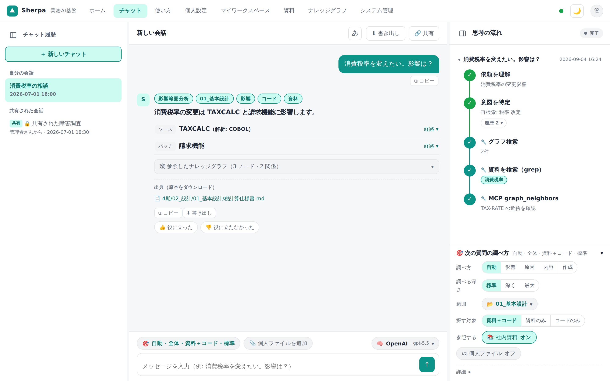
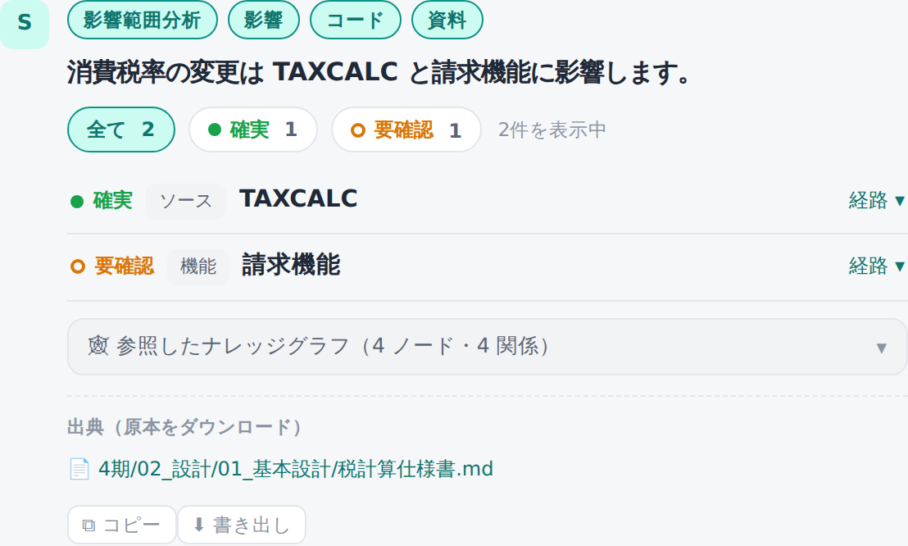
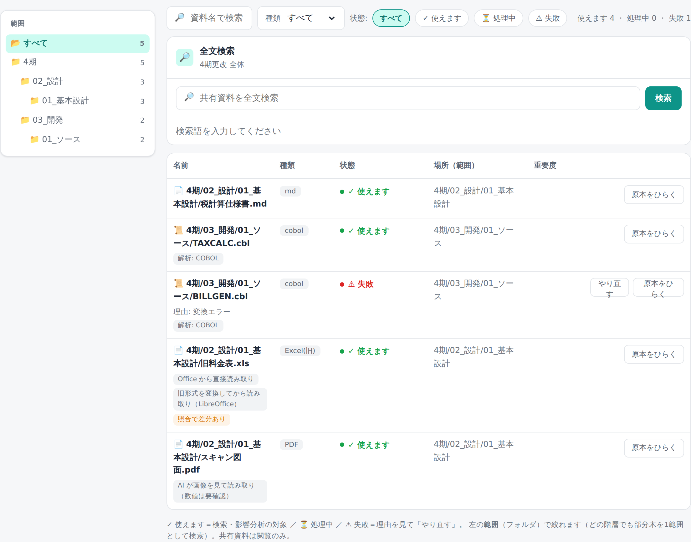

# Sherpa

<p align="center"></p>

Sherpa は、社内の設計書・仕様書・Office 資料・COBOL/JCL/コピーブックといった業務ドキュメントを対象に、
**チャットで検索・影響範囲の調査・トラブルシュートができる Agentic RAG 基盤**です。
資料フォルダを登録すると、全文検索とナレッジグラフが構築され、根拠（出典）つきの回答が返ります。

## できること

- **チャットで調べる**: 「消費税率を変えると何に影響する？」のような自然文の質問に、根拠つきで回答します。
- **影響範囲分析**: 変更が波及するソース・データ項目・関連文書を、依存関係をたどって漏れなく洗い出します。
- **フォルダ＝そのまま取り込み**: 登録したフォルダ構造がそのまま検索・分析の範囲になります（コピー・変換の手間なし・更新や削除も自動で反映）。
- **閉域ネットワーク対応**: インターネットに出られない環境向けの一括導入キットを用意しています。
- **共有と監査**: 会話の共有は招待制・閲覧専用・期限つき。操作は改ざん検知つきの監査ログに残ります。

## 画面

<p>
  
  
  
</p>

## 動作環境

- WSL2 または Linux
- Docker Engine / Docker Compose
- Python 3.12
- PostgreSQL / Elasticsearch / Neo4j（Docker で起動、アプリ本体はホスト直で動作）

## クイックスタート

```bash
git clone <このリポジトリのURL>
cd Sherpa
make bootstrap   # 初回準備（.env 作成・作業ディレクトリ用意）
make start       # 依存インストール・ストア起動・アプリ起動
```

起動したらブラウザで <http://127.0.0.1:8000/ui/chat.html> を開きます。初回ログインの手順・パスワード変更・
LAN 公開・常駐運用など詳しい手順は [製品マニュアル](docs/manual/README.md) を参照してください。

停止は `make stop`、状態確認は `make status` です。

## ドキュメント

- **[製品マニュアル](docs/manual/README.md)** — 使い方・管理・運用の手順（利用者・管理者・運用担当向け）
- **[設計ドキュメント](docs/README.md)** — アーキテクチャ・データモデル・設計判断（開発者向け）

## ライセンス

本リポジトリは **source-available（許可制）** で公開しています。OSS ライセンスではありません。
利用・複製・改変には著作権者の事前許可が必要で、再配布・公開はできません。詳細は [LICENSE](LICENSE) を参照してください。
