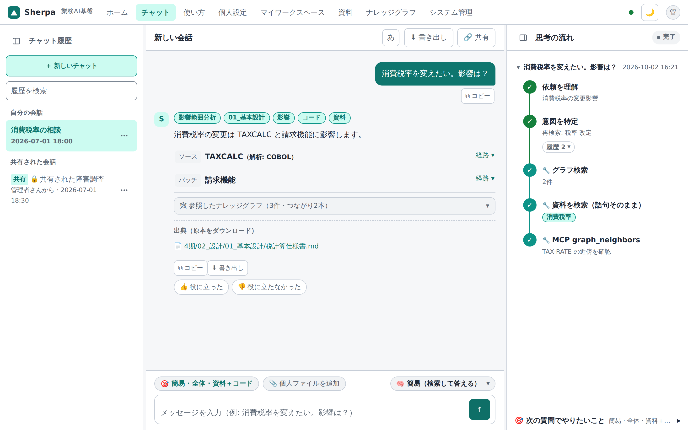
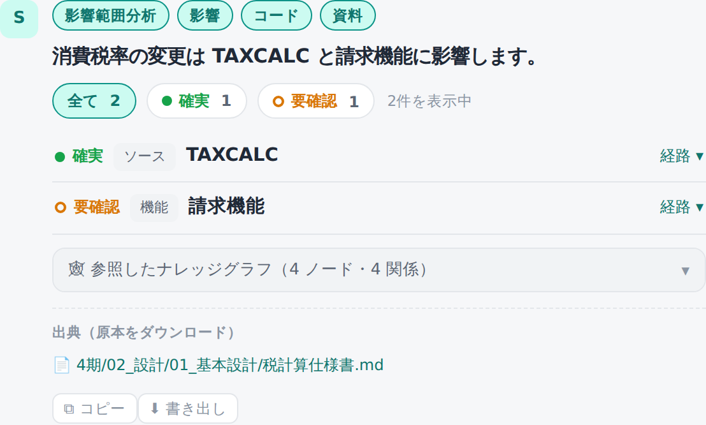
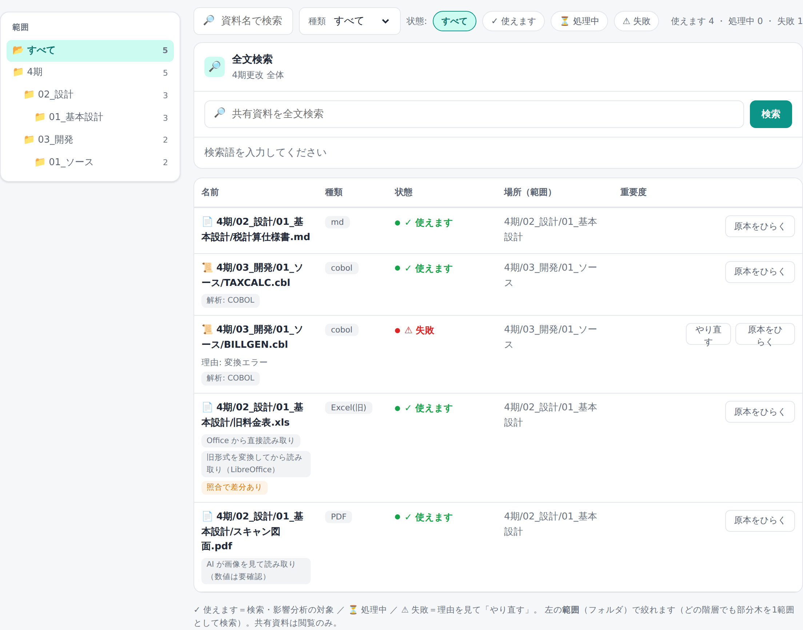
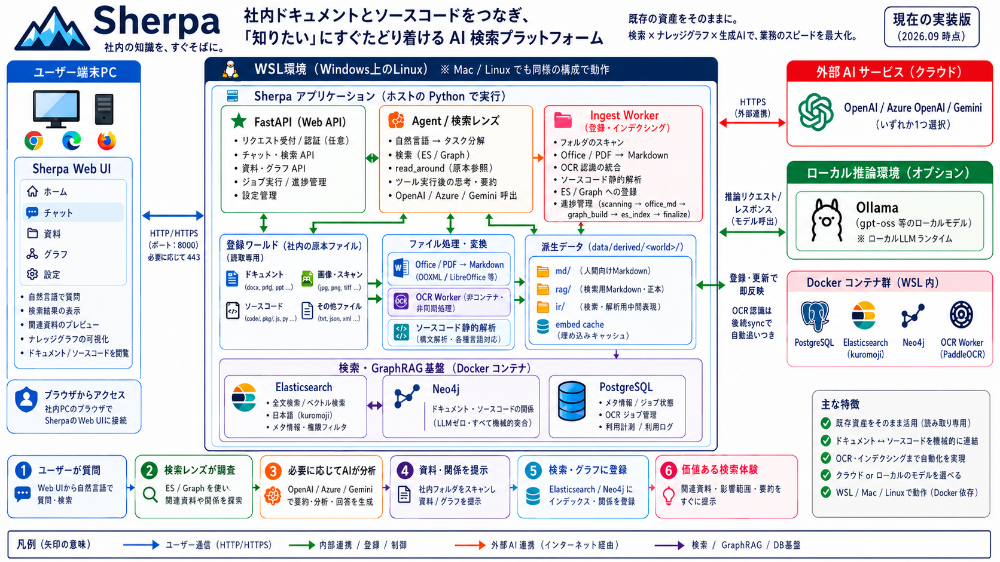

# Sherpa

<p align="center"></p>

Sherpa は、社内の設計書・仕様書・Office 資料・COBOL/JCL/コピーブックといった業務ドキュメントを対象に、
**チャットで検索・影響範囲の調査・トラブルシュートができる Agentic RAG 基盤**です。
資料フォルダを登録すると、全文検索とナレッジグラフが構築され、根拠（出典）つきの回答が返ります。

## できること

- **チャットで調べる**: 「消費税率を変えると何に影響する？」のような自然文の質問に、根拠つきで回答します。
- **影響範囲分析**: 変更が波及するソース・データ項目・関連文書を、依存関係をたどって漏れなく洗い出します。
- **フォルダ＝そのまま取り込み**: 登録したフォルダ構造がそのまま検索・分析の範囲になります（コピー・変換の手間なし・更新や削除も自動で反映）。
- **閉域ネットワーク対応**: インターネットに出られない環境向けの一括導入キットを用意しています。
- **共有と監査**: 会話の共有は招待制・閲覧専用・期限つき。操作は改ざん検知つきの監査ログに残ります。

## 画面

<p>
  
  
  
</p>

## 全体像

<p align="center"></p>

## 動作環境

- WSL2 または Linux
- Docker Engine / Docker Compose
- Python 3.12
- PostgreSQL / Elasticsearch / Neo4j（Docker で起動、アプリ本体はホスト直で動作）

## クイックスタート

```bash
git clone <このリポジトリのURL>
cd Sherpa
make bootstrap   # 初回準備（.env 作成・作業ディレクトリ用意）
make start       # 依存インストール・ストア起動・アプリ起動
```

起動したらブラウザで <http://127.0.0.1:8000/ui/chat.html> を開きます。初回ログインの手順・パスワード変更・
LAN 公開・常駐運用など詳しい手順は [製品マニュアル](docs/manual/README.md) を参照してください。

停止は `make stop`、状態確認は `make status` です。

## パッケージでの導入・更新（本番・閉域）

配布パッケージ（`sherpa-<版>-<full|app>-<短いコミットハッシュ>.tar.gz`）は、初回導入も更新も同じ手順です。
初回導入はフルのパッケージだけです（`<作業フォルダ>`・`<圧縮ファイル名>` は環境の値に読み替えてください）。

```bash
cd <作業フォルダ>
sha256sum -c <圧縮ファイル名>.sha256      # macOS は shasum -a 256 -c。失敗したら展開しない
tar xzf <圧縮ファイル名>                   # Sherpa/ ができる（更新では上書きされる）
cd Sherpa && ./install.sh 2>&1 | tee ~/install-sherpa.log
make check-ports && make start            # 更新のときは、最初に make stop
```

`.env`・`data/`・`.venv`・`tools/` の実行物はパッケージに入っていないので、上書き展開で消えません。`Sherpa/` の中のパッケージの
ファイルは更新のたびに置き換わります（編集しないでください）。手順の全文は `INSTALL.md`（パッケージにも入っています）、
元に戻す手順・systemd での常駐・閉域の資材の作り方は [運用マニュアル](docs/manual/40-運用.md)・
[閉域向け配布資材キット](docs/manual/offline-kit.md) を参照してください。

## ドキュメント

- **[製品マニュアル](docs/manual/README.md)** — 使い方・管理・運用の手順（利用者・管理者・運用担当向け）
- **[設計ドキュメント](docs/README.md)** — アーキテクチャ・データモデル・設計判断（開発者向け）

## ライセンス

本リポジトリは **ソース公開・許可制（source-available）** です。OSS ライセンスではありません。

- 閲覧と、自分の環境での評価・学習目的の利用・改変は自由です。
- 業務・商用での利用、第三者への提供・再配布（組織内の別のプロジェクトへの提供を含む）、SaaS としての提供には、著作権者の書面による許諾が必要です。
- 許諾の無い再配布・公開はできません。許諾を受けて改変した場合は、なるべくその内容を著作権者へ提供してください（義務ではありません）。

詳細は [LICENSE](LICENSE) を参照してください。第三者ソフトウェアのライセンスは `NOTICE` と `licenses/` にあります。

### 許諾の問い合わせ

許諾のご相談は、このリポジトリの [Issues](../../issues) に「ライセンス相談」と書いて起票してください。
気づくのが遅れることがあります。返事が無いときは、同じ Issue に遠慮なく催促を書き込んでください。
