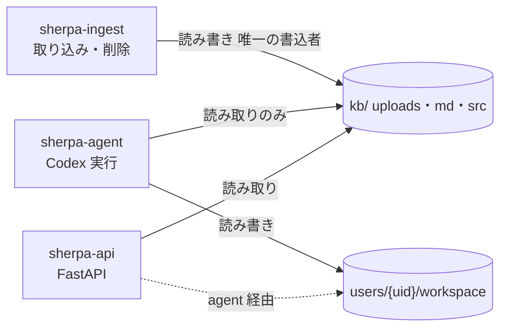

# 実行時のディレクトリ・権限・サンドボックス（物理設計）

> **⚠ 2026-06-28 取り込み/範囲は [03-鏡モデル.md](03-鏡モデル.md) が一次情報・移行完了**。
> 本書の `uploads/{version}`・`md/{version}`・`src/{version}` の version 別ディレクトリ表記は**登録ディレクトリ（world）配下の1フォルダ木**へ置換済
> （本番 `data/kb/{world}/…`＝読み取り専用は不変。dev `fixtures/corpus/{world}/` は**テストデータ＝テストが緑であれば再構成可**・決定2026-06-28）。矛盾時は [03-鏡モデル.md](03-鏡モデル.md) を優先。

> 本書が定めるディレクトリ・権限の決まりを、
> **信頼ではなく機構で強制**する設計。`uploads/` `md/` は絶対に改変・削除させない／
> 書き込みは `workspace/` のみ／機密ファイルは外部に出さない。
> 原則は**多層防御**：どれか1層が破れても改変・流出が起きない。

## 0. 実行ユーザー（権限分離）
| ユーザー | 役割 | kb/（uploads・md・src） | users/*/workspace |
|----------|------|-------------------|-------------------|
| `sherpa-ingest` | 取り込みワーカー・カスケード削除（**唯一の kb 書込者**） | 読み書き | — |
| `sherpa-agent` | Codex エージェント実行 | **読み取りのみ** | 読み書き |
| `sherpa-api` | FastAPI（認証・経路制御・セッション） | 読み取り | （agent 経由） |

エージェントが kb を書けないのは「お行儀」ではなく**所有権で不可能**にする。

> **provisioning（2026-07-01）**: `scripts/setup-runtime-users.sh` がこの分離を機構化する
> （`sherpa`/`sherpa-ingest`/`sherpa-agent`/`sherpa-api` を作成・`kb` を group 書込なしで sherpa-ingest 所有・
> agent を ingest グループに入れない・`users/` を sherpa-agent 所有）。冪等・`--dry-run`／`--verify` 付き。
> permission profile（アプリ層 `sherpa/agents.py`）と併せた**多層防御の下層**（profile が破れても所有権で kb/他人領域を書けない）。



## 0.5 デプロイ構成（何をコンテナに入れるか）— 決定（恒久）
**コンテナ化は DB/ストアのみ。アプリ核は恒久的にホスト直。** （MVP に限らず原則。）

| 構成要素 | 置き場所 | 理由 |
|----------|----------|------|
| ストア（Postgres / Neo4j / Elasticsearch） | **Docker** | DB。interop 不要・再現性が得やすい |
| アプリ核（FastAPI ＋ **Codex Runner** ＋ 取り込み ＋ OOXML/静的解析） | **WSL ホスト直（恒久）** | Codex の sandbox は**ホストネイティブ**（systemd＋Landlock/seccomp＋bwrap・§3/§5）。標準コンテナに入れると内側 sandbox（user/mount ns・seccomp・Landlock）が Docker と衝突し `--privileged` 化を招く＝本末転倒 |
| **② Office COM** | **Windows-side の独立ワーカー（非コンテナ・API）** | `powershell.exe`／COM interop に触れる**唯一**の部品。Linux 側は API（`POST /convert`）で呼ぶ（INGEST-MD §Office COM） |
| ローカルLLM（Ollama / DGX Spark） | 別サービス/別筐体 | DGX は別ハード・現状 NW 未接続 |

**禁止**: `codex exec` を標準コンテナ内で動かす／そのために `--privileged`・広い capability を付ける。
隔離を更に強めるなら **microVM（Firecracker 系）＝コンテナの“外側”隔離**に寄せる（内側 sandbox と衝突しない）。

**なぜ恒久に“ホストネイティブ”か（決定理由）**: Sherpa は Windows/WSL の**ネイティブ前提**で価値を出す ―
(1) **Codex** の安全な実行は host sandbox（systemd/Landlock/seccomp）に依存、(2) **Office COM** は Windows ネイティブの**高忠実**が存在理由。
アプリをコンテナ化してネイティブ前提を捨てると、**Codex sandbox は壊れ、Office COM（有償）を選ぶ意味も消える**
＝それなら**無償の LibreOffice で十分**になり、Office ライセンス投資が無意味化する。
よって「**DB-only コンテナ／アプリはホスト**」を**恒久原則**とし、ネイティブの利点（Codex 安全実行・Office 高忠実）を一貫して取りに行く。

**宿題（実装時）**: ① 読取隔離（セッション別 bind mount）を Phase 1 で必ず有効化（§2/§5）。② `network_access=false` の実効を実機確認（§3 残）。

## 1. ディレクトリ実体（パス・所有者・mode）
```
/srv/sherpa/
  kb/
    uploads/{version}/…   sherpa-ingest:sherpa   dir 0755 / file 0644   → agent は read only（原本・Office等）
    md/{version}/…        sherpa-ingest:sherpa   dir 0755 / file 0644   → agent は read only（Office/PDF→決定的MD）
    src/{version}/…       sherpa-ingest:sherpa   dir 0755 / file 0644   → agent は read only（cobol/jcl/copybook plain text・MD化しない・grep対象）
  users/{uid}/workspace/  sherpa-agent:sherpa-agent  0700               → agent は read/write
    outputs/  tmp/
```
- `kb/` はグループ書込なし。`sherpa-agent` は `sherpa-ingest` グループに**入れない** → FS レベルで書込不可。
- `workspace/` は 0700。cross-user はアプリ（FastAPI）が**そのユーザーの workspace だけ**を可書きに紐付け。
- 現行の host-native API 起動では、workspace 書込に `sherpa-workspace` グループを使う
  （`scripts/setup-runtime-users.sh`）。systemd の `sherpa-api.service` は `sherpa-api:sherpa-workspace` で起動する。

## 2. 多層防御（5層）
| 層 | 機構 | 何を保証 |
|----|------|---------|
| **L1 OS 権限** | 所有権/mode/ACL（上表） | agent は kb を物理的に書けない |
| **L2 マウント** | `kb` を **read-only bind mount**、当該 `workspace` のみ rw でセッションに供給 | 設定ミスでも kb は不変 |
| **L3 Codex サンドボックス** | `workspace-write` ＋ `writable_roots=[該当workspace]` ＋ 実行コマンドの **network 遮断**（Linux: Landlock + seccomp） | エージェントの書込先を workspace に限定、シェルからの外部送信を遮断 |
| **L4 コマンド許可** | 検索/grep は自動許可、書込は workspace 限定、破壊的コマンドは拒否 | 経路の自動実行を安全側に |
| **L5 アプリ** | FastAPI が経路・パス・所有者を検証。uploads/md/src を可書きとして渡さない | 入口で誤りを止める |

> **multi-user の読取隔離（決定: セッション別 bind mount）**: `writable_roots` は**書込**制限のみで読取は
> 防げないため、**セッション起動時に当該ユーザーの workspace だけを名前空間内に bind mount し、他ユーザーの
> workspace と `users/` 親を見せない**（[PrivateMounts/PrivateTmp＋`ReadWritePaths` を当該 workspace のみ] /
> `mount --bind` ＋ mount namespace）。既存 systemd `sherpa-agent@uid` に自然に乗る。MVP は単一ユーザーで不要、
> **Phase 1（ログイン導入）で有効化**。per-user UID / コンテナ隔離は将来の強化オプション。

## 3. Codex 権限プロファイル（実機確認: Codex 0.139.0）
**CLI フラグで制御**（検証済み）。プロファイルは `$CODEX_HOME/<name>.config.toml` を `-p <name>` で
ベース config に重ねる（旧 `[profiles.x]` インライン記法ではない）。
```bash
codex exec --json \
  --sandbox workspace-write \          # read-only | workspace-write | danger-full-access
  -C  /srv/sherpa/users/$SHERPA_UID/workspace \   # cwd＝主たる書込先
  --add-dir /srv/sherpa/users/$SHERPA_UID/workspace/outputs \  # 追加の書込先（必要時）
  --skip-git-repo-check \              # workspace は非 git
  -p sherpa \                          # $CODEX_HOME/sherpa.config.toml を重ねる
  "<prompt>"
# 単発(api/MVP)は --ephemeral でセッション非永続。chat は付けず resume 可能に。
```
- `workspace-write` は **FS 全体を読み取り可・書込は cwd(`-C`)＋`--add-dir` に限定**。
  → uploads/md/src は**読めるが書けない**（要件どおり）。L1/L2 と二重化。
- セッション起動時に FastAPI が **`-C` ＝ 当該 workspace**、`SHERPA_UID` を注入。
- メイン/サブの分担は `-m`（model）＋ `--oss --local-provider ollama`（§6・ローカル）。
- **承認**: `exec` は非対話で人手承認なし。完全バイパス（`--dangerously-bypass-approvals-and-sandbox`）は
  **使わない**（サンドボックスは `--sandbox` で効かせる）。
- **config で固定する場合**（CLI フラグの代替）: 実 config に **`[sandbox_workspace_write]` セクション実在を確認**。
  ```toml
  [sandbox_workspace_write]
  writable_roots = ["/srv/sherpa/users/${SHERPA_UID}/workspace"]   # --add-dir の config 版
  network_access = false                                           # 実行コマンドの外部通信遮断（有力・既定挙動は実走で確認）
  ```
- **要確認（残）**: `network_access` の既定値と効き（workspace-write 時）を実走で確認。

## 4. ネットワークと推論経路（機密の要）
**鍵**: 「Codex 本体の API 呼び出し」と「エージェントが実行するシェルコマンド」を分けて考える。
- **実行シェルコマンド**: `network_access=false` で**外部通信を全遮断**（`curl` 等での持ち出し不可）。
- **検索（grep / ES / Neo4j）**: サンドボックス内シェルから叩かず、**MCP ツール／FastAPI 経由**で
  実行（オーケストレータ側）。よってシェルに DB ネットワークを開ける必要がない（§7 と整合）。
- **メイン推論（OpenAI）**: Codex プロセス自身の HTTP であり、コマンドサンドボックスの対象外。
  **テキストのみ送信・ファイルは送らない**（決定3）。
- **機密モード `local_only`（R11）**: アプリが推論を Ollama に振り、OpenAI への外部送信を行わない。
  systemd 側で当該セッションの**外部 egress を拒否**して二重化してもよい。

## 5. systemd ハードニング（セッション実行ユニット例）
```ini
# sherpa-agent@.service （%i = uid。FastAPI が起動・停止）
[Service]
User=sherpa-agent
WorkingDirectory=/srv/sherpa/users/%i/workspace
ExecStart=/usr/local/bin/sherpa-run-codex %i
ProtectSystem=strict                 # / を読み取り専用化
ReadOnlyPaths=/srv/sherpa/kb         # kb は明示的に read-only
# 読取隔離（決定）: 当該ユーザーの workspace だけを名前空間内に bind、users/ 親や他ユーザーは見せない
TemporaryFileSystem=/srv/sherpa/users:ro
BindPaths=/srv/sherpa/users/%i/workspace
ReadWritePaths=/srv/sherpa/users/%i/workspace
PrivateTmp=true
ProtectHome=true
NoNewPrivileges=true
RestrictSUIDSGID=true
# 機密モード時のみ外部 egress を遮断（通常は OpenAI 用に許可）:
# IPAddressDeny=any  →  別ユニット/ドロップインで local_only セッションに適用
```
WSL2 は Landlock/seccomp/systemd 利用可（`wsl.conf` で `systemd=true`、カーネル 6.x）。

## 6. TTL クリーンアップ / カスケード削除
- **個人ファイル TTL**: `documents(scope=personal).expires_at` を過ぎたら削除する systemd timer
  （`sherpa-agent` 権限で workspace 内のみ操作）。索引化していないので ES/Neo4j 操作は不要。
- **カスケード削除**: 共有 KB は `sherpa-ingest` のみが実行。`documents.original_path`(uploads/ or src/)・
  MD・`es_ids`/`neo4j_ids` を辿って **原本・MD・ES チャンク・Neo4j ノード**を削除。エージェントは関与しない（kb 書込権なし）。

## 7. APIキー・シークレット管理（管理者）
原則: **サービス所有・利用者は触れない・コードに置かない・注入は実行時のみ・サンドボックスへ漏らさない**。

**A6（個人 API キー原則・実装済み・SET-1・2026-08-22／個人キー一括削除は2026-08-23）**:
「利用者ごとには発行しない」は `system_settings.personal_api_keys_allowed`（既定 `false`）で
コードとして強制する（`sherpa/keys.py::resolve_api_key`）。
OFF のときは個人設定画面にクラウド AI のキー入力欄が出ず、直接 API を叩いても `PUT /settings` が
422 で拒否する。加えて、OFF のとき個人キーは DB 上にも存在しない状態を保つ: 管理者が
`personal_api_keys_allowed` を false で保存するたび（true→false の遷移に限らず・冪等）、全ユーザーの
個人秘密キー（openai/gemini/bedrock）を `user_settings` から一括削除する
（`sherpa/store/settings.py::purge_personal_api_keys`・監査ログ `user_settings.personal_keys_purged`
に削除件数を記録）。既存 DB へのアップグレード直後にも適用するため、起動時（lifespan・env シードの後）
にも同じ削除を冪等に実行する（`sherpa/api.py::_purge_personal_keys_if_disabled_on_startup`）。
ON にする運用（利用者ごとの個人キーを許容）も選べるが、既定は本節の原則どおり OFF。
A7（非選択プロバイダのキーは消さず使わない）とは別の規律。

- **発行**: OpenAI の **プロジェクト単位キー**を Sherpa 専用に。**予算上限**設定。組織ルートキーは使わない
  （漏洩時の影響限定・単独失効）。利用者ごとには発行しない（利用者は Sherpa ログインのみ、キーは不可視）。
- **保管**: **systemd 暗号化クレデンシャル**（`systemd-creds encrypt` ＋ `LoadCredentialEncrypted=`）。
  起動時に tmpfs へ復号、当該サービスユーザーのみ読取、停止で消滅。将来は Vault/KMS。
  **禁止**: リポジトリ／`config.toml` コミット／シェルプロファイル／イメージ層への埋め込み。
  `.gitignore` ＋ シークレットスキャンで流入防止。
- **注入**: 起動ラッパーが `$CREDENTIALS_DIRECTORY/openai_key` を読み、Codex 子プロセスにだけ
  `OPENAI_API_KEY` を export。平文 dotfile に残さない（auth.json を使うなら tmpfs・`0600`）。
- **サンドボックス分離**: キーは Codex オーケストレータには渡すが、**実行シェルコマンドの env には渡さない**
  （`env` 露出防止。network 遮断済みでも多層防御で env スクラブ）。
- **ローテーション**: 定期＋漏洩時即時。手順は「ストア更新＋再起動」。**二重鍵オーバーラップ**で無停止。Runbook 化。
- **監視/帰属**: OpenAI プロジェクトの使用量ダッシュボード＋予算アラート。自前ログ（messages/analyses）で
  利用者・会話単位にコスト帰属。**キー値はログに出さない**。
- **機密モード `local_only`**: Ollama 経路でキーを使わない。ルーティングがキーを通らないことを担保。

## 8. 残論点（実装時に確認）
1. ~~Codex 版差異~~ → **実機確認済み（0.139.0・§3）**: `--sandbox`/`-C`/`--add-dir`/`-p`/
   `--skip-git-repo-check`/`--ephemeral`/`--oss --local-provider ollama` を確認。
   **残: 実行コマンドの network 無効化 config キー**（`sandbox_permissions` 系か）の確定。
2. **隔離強度の選択**: MVP は「専用ユーザー＋bind mount＋Codex サンドボックス＋systemd 硬化」。
   さらに強くするなら**コンテナ**（per-session、ReadOnly rootfs、egress 制御）も選択肢。
3. ~~workspace 読取隔離~~ → **決定: セッション別 bind mount**（当該 workspace のみマウント・§2/§5）。
   MVP は単一ユーザーで不要、**Phase 1 で有効化**。per-user UID / コンテナは将来の強化。
4. **検索ツールの実行境界**: ES/Neo4j を MCP ツールにするか FastAPI 内部 API にするか（§7）。

## 9. Marp レンダの実証（M1・2026-07-08）
Marp スライド出力機能の設計検討における M1（技術リスク解消）を**技術実証プローブ**で実施。
目的＝「ネットワーク遮断環境で Marp CLI が HTML/PDF/PPTX をレンダできるか」を白黒つける。**結論: 3形式すべて遮断下で成功**（PDF/PPTX は loopback が上がっていることが条件・実サンドボックスは満たす）。

**検証環境**（実装ではなくプローブ・未コミット）
- marp-cli **v4.4.1**（w/ marp-core v4.3.1）を **プロジェクトローカル** `tools/marp/` に導入
  （`npm --prefix tools/marp install @marp-team/marp-cli`・node v22.22.3）。`node_modules`(130M) は既存 `.gitignore` の `node_modules/` で追跡外。
- marp-cli は **puppeteer-core** 同梱（Chromium はバンドルしない）→ **ブラウザは外部指定が必須**。
- **`CHROME_PATH`** に e2e 用の既存 Playwright Chromium を流用（新規 DL なし）:
  `~/.cache/ms-playwright/chromium-1228/chrome-linux64/chrome`。marp は env `CHROME_PATH`/`CHROMIUM_PATH` と CLI `--browser-path` の両方を尊重。
- 遮断は **`unshare -rn`**（＝`unshare --map-root-user --net`）で近似。**素の `unshare -n` は EPERM で不可**なので `-r`（root マップ）併用が必須。外部到達不可は `/dev/tcp/1.1.1.1/443` が `Network is unreachable` になることで確認。

**可否マトリクス**（○＝成功 / ×＝失敗、括弧内は所要秒）

| 形式 | ブラウザ | 通常環境 | 遮断（unshare -rn, lo UP） | 遮断（lo DOWN・素の namespace） |
|------|---------|----------|----------------------------|-------------------------------|
| HTML | 不要     | ○ (0.6s) | ○ (0.6s)                   | ○ (0.7s)                      |
| PDF  | 必要     | ○ (3.3s) | ○ (1.8s)                   | ×（websocket ErrorEvent）      |
| PPTX | 必要     | ○ (2.1s) | ○ (2.1s)                   | ×（websocket ErrorEvent）      |

- 遮断下と通常環境の出力は**バイト同一**（PDF 151993 / PPTX 373370）＝レンダは決定的・オフラインでも同結果。
- **つまずきと回避策**: 素の新規ネットワーク名前空間は loopback(`lo`) が DOWN のため、puppeteer が localhost 経由で Chromium に接続できず PDF/PPTX が `ErrorEvent` で失敗。`ip link set lo up`（namespace 内 root で実行）で解消。**Docker 既定や Codex sandbox は lo が UP なので実運用では該当しない**。万一 loopback が使えない環境向けの逃げ道として marp に `--browser-protocol {cdp|webSocket}` がある。

**必要フラグ（重要）**
- marp-cli v4 は Chromium 起動時に **`--no-sandbox --disable-gpu --disable-component-update --headless` を既定で付与**する（lib で確認）。
  → **手動の `--no-sandbox` は不要**。`unshare -rn`（user namespace 内 root）でも sandbox 追加指定なしで PDF/PPTX が成功した。
- したがって M2 の呼び方は **`CHROME_PATH=<chromium> marp 資料.md --pptx -o 資料.pptx`** で足りる（追加の Chromium フラグ不要）。

**フォント状況**
- **Noto Sans CJK JP は不在**（`fc-list` は `Noto Color Emoji` のみ）。ただし system に **IPAGothic**（`/usr/share/fonts/truetype/fonts-japanese-gothic.ttf`・`ipafont-gothic`）と WenQuanYi/Unifont-JP があり、**日本語は IPAGothic でフォールバック描画され文字化けなし**（見出し・表・箇条書き・ページ番号を PNG 目視で確認）。
- M2 推奨: 見た目の安定とテーマ側フォント指定のため **Noto Sans CJK JP を明示導入**（インストールはユーザー判断。オフラインキット `scripts/make_offline_kit.sh` に同梱物として追記）。

**PPTX は画像ベース（起案書の主張を確認）**
- 生成 PPTX の各スライドは native text run(`<a:t>`)＝**0**。背景 `blipFill` で **1スライド＝1枚 PNG**（`ppt/media/Slide-N-image-1.png`）を貼る構造 → **PowerPoint で本文編集は不可**（起案書の表と一致）。
- marp v4 に `--pptx-editable`（EXPERIMENTAL）はあるが既定は画像。編集可能 PPTX が要る用途は既存 python-pptx スキルへ（起案書の使い分けどおり）。

**再現コマンド**
```bash
# 1) ローカル導入（ここだけ network 使用・リポジトリ直下で実行）
npm --prefix ./tools/marp install @marp-team/marp-cli
MARP=$(pwd)/tools/marp/node_modules/.bin/marp
export CHROME_PATH=~/.cache/ms-playwright/chromium-1228/chrome-linux64/chrome   # 環境の chromium パスに読み替え

# 2) 通常環境
$MARP sample.md -o out.html          # HTML（ブラウザ不要）
$MARP sample.md --pdf  -o out.pdf     # PDF
$MARP sample.md --pptx -o out.pptx    # PPTX（画像）

# 3) ネットワーク遮断で再実証（lo を UP して実サンドボックス相当に）
unshare -rn -- bash -c '
  ip link set lo up
  export CHROME_PATH=~/.cache/ms-playwright/chromium-1228/chrome-linux64/chrome
  '"$MARP"' sample.md -o out.html
  '"$MARP"' sample.md --pdf  -o out.pdf
  '"$MARP"' sample.md --pptx -o out.pptx
'
```

**M2 への推奨構成**
- marp の呼び方: `CHROME_PATH=<常設 Chromium> marp 資料.md --pptx|--pdf|--html -o 資料.<ext>`（追加フラグ不要・`--no-sandbox` は marp が既定付与）。
- Chromium: ホスト常設 or Playwright の既存 chromium を流用（`CHROME_PATH` 固定）。オフラインキットに Chromium＋marp＋Noto CJK を同梱。
- フォント: **Noto Sans CJK JP を導入**しテーマ CSS で明示指定（現状は IPAGothic フォールバックで代替可）。
- 実サンドボックスの loopback が UP であることのみ M2 で実機確認（本プローブは `unshare` 近似で成立を確認済）。

## 10. Marp の実機サンドボックス E2E（2026-07-08・permission profile 本番相当）

§9 は `unshare -rn` による**近似**（ネットワーク到達性のみを模擬）だった。ここでは Codex authoring が実際に使う
**permission profile**（`:root=deny`＋`:minimal=read`＋KB=read＋`network.enabled=false`・
[codex-sandbox-permission-profile] メモリ・`sherpa/providers/codex/sandbox.py::_write_codex_authoring_config`）を
`codex sandbox -P sherpa-authoring -C <authoring>`（決定的・モデル呼び出し無し）で直接検証した。

**結論**: HTML は read root 追加で成功。**PDF/PPTX は `network.enabled=false` が原因で失敗**（§9 のネットワーク
namespace 近似では起きなかった、実機固有の問題）。

### 10.1 read root なし（既定）→ marp/Chromium が sandbox から不可視

`_marp_env` が渡す env 変数（`SHERPA_MARP_BIN`/`CHROME_PATH`）だけでは、そのパス自体は permission profile の
read 許可リストに入らない。`:root=deny` 下ではパスが**存在しないものとして扱われる**（Permission denied ではなく
`No such file or directory` / `Cannot find module`）。

### 10.2 read root 追加 → HTML 成功（実装済み・2026-07-08）

`tools/marp`（marp-cli 本体・node_modules 一式）と Chromium のバージョン付きディレクトリ
（`~/.cache/ms-playwright/chromium-NNNN`）の2つを read root に追加すると HTML レンダが成功する。
`sherpa/agents.py::_marp_permission_roots()` が両パスを解決し、`_kb_read_roots(world) + _marp_permission_roots()`
として `_write_codex_authoring_config` に渡す（marp/Chromium 未導入環境では空リスト＝害なし）。

```
[permissions.sherpa-authoring.filesystem]
":root" = "deny"
":minimal" = "read"
"<KB>" = "read"
"<repo>/tools/marp" = "read"
"~/.cache/ms-playwright/chromium-NNNN" = "read"
```

### 10.3 PDF/PPTX は現状ブロック（`network.enabled=false` が原因・未解決）

read root 追加後も `--pdf`/`--pptx` は失敗する:

```
[ ERROR ] Failed converting Markdown. (Failed to launch the browser process:
  stderr: [...] crashpad/util/linux/socket.cc:45] setsockopt: Operation not permitted (1))
```

**原因の切り分け**（`network.enabled=true` に変えると同一 profile で PDF が成功することを確認済み・診断のみで
本番には適用しない）: Chromium の Crashpad クラッシュハンドラが起動時に張るローカル IPC 用ソケットの
`setsockopt` が、`network.enabled=false` の seccomp フィルタで実際の外部到達性とは無関係に一律 EPERM になる。
§9 の `unshare -rn` 近似（ネットワーク**名前空間**の分離）ではこの種のソケット呼び出し自体は許可されていたため
検出できなかった、permission profile 固有の制約。

`codex` バイナリの文字列解析では `network` 権限に `unix_sockets` / `allow_local_binding` /
`dangerously_allow_all_unix_sockets` 等、ローカルソケットのみを許可する**より細かいフィールドが存在する**ことが
確認できたが、正式な TOML 構文は非公開で、憶測でセキュリティ設定を書くのは危険と判断し今回は採用しなかった。

**現状の選択肢**（ユーザー判断待ち）:
1. `network` のローカルソケット限定許可フィールドを公式ドキュメント/Codex 側への確認で確定させ、
   sandbox 内で PDF/PPTX まで通す（実装済みの HTML 用 read root に加えて network 設定を追加）。
2. PDF/PPTX のレンダを Codex のサンドボックス実行から外し、**Sherpa 自身の信頼された backend プロセス**が
   Codex 完了後に `.md` を読んで後段レンダする（marp-agent の元々の哲学「LLM はテキストだけ書く」に近い設計）。
3. 当面 **HTML のみ**をサンドボックス内既定にし、PDF/PPTX は非サンドボックス経路（`SHERPA_CODEX_SANDBOX=0`）
   でのみ提供する。

いずれも未実装（read root 追加＝HTML 成功のみ実装済み・commit は次項参照）。

**M3 実装（2026-07-12・選択肢2を採用）**: Codex は sandbox 内で marp CLI を直接呼ばず `.md` を
書くだけにし、レンダ（HTML/PDF/PPTX）は Codex 完了後に **Sherpa 本体プロセス**が `unshare -rn`
（§9 の M1 実証条件どおり `ip link set lo up` してから marp を実行）で行う設計に変更した
（`sherpa/marp_render.py`）。これにより `_marp_env`/`_marp_permission_roots`（marp/Chromium を
permission profile の read root に追加する仕組み）は不要になり撤去済み＝サンドボックスに
marp/Chromium を見せる必要が無くなった（攻撃面縮小）。§10.1〜§10.3 の「read root 追加が要る」
「PDF/PPTX が network.enabled=false でブロックされる」という記述は、**Codex サンドボックス内で
marp を実行していた M2 までの設計**についての記録として残す（marp_render.py は sandbox の外＝
Sherpa 本体側で動くため、この制約を受けない）。

## 11. Codex(OpenAI) の接続先が Azure OpenAI 等のとき（S2・2026-08-18）

閉域実機の LLM が Azure OpenAI だった場合の対応。接続先そのものの設定・判定（`OPENAI_BASE_URL`／
`SHERPA_OPENAI_AUTH_HEADER`／`SHERPA_OPENAI_API_VERSION`・`openai_endpoint_kind()` の判定基準）は
`sherpa/llm.py` が一次情報（実装済み）。ここでは Codex CLI 側の `config.toml` にどう反映するかだけを記す
（実装は `sherpa/providers/codex/sandbox.py::_openai_compat_provider_lines`／
`_write_codex_authoring_config`）。

- **既定（`OPENAI_BASE_URL` 未設定・api.openai.com）では何も変わらない**: `model_provider`/
  `model_providers` を一切書かず、Codex は組込み `openai` provider と `auth.json`（実 home からの
  symlink・§7 と同じ経路）のまま動く。
- **接続先が既定以外（Azure 等）のときだけ**、`§3 の permission profile` に加えて独自
  `[model_providers.sherpa-openai-compat]` を書く（Ollama 構成の `sherpa-ollama` と同型・組込み
  provider id は上書き不可のため独自 id を使う）:
  ```toml
  model_provider = "sherpa-openai-compat"

  [model_providers.sherpa-openai-compat]
  name = "OpenAI 互換エンドポイント"
  base_url = "https://<リソース名>.openai.azure.com/openai/v1"
  env_key = "OPENAI_API_KEY"
  wire_api = "responses"
  # SHERPA_OPENAI_API_VERSION 設定時だけ:
  query_params = { "api-version" = "2025-04-01-preview" }
  # SHERPA_OPENAI_AUTH_HEADER=api-key のときだけ（env 変数名を書く・値は書かない）:
  env_http_headers = { "api-key" = "OPENAI_API_KEY" }
  ```
- **キーは `env_key` で Codex 子プロセスの環境変数から読む**（`auth.json` 経由ではない＝カスタム
  provider は `requires_openai_auth = true` を設定していないため）。そのため
  `sherpa/providers/codex/sandbox.py::_codex_clean_env` はこの構成の時**だけ** `OPENAI_API_KEY`
  を子プロセス env に渡す（`openai_api_key` 引数・既定は渡さない＝§7「実行シェルコマンドの env には
  渡さない」不変条件は維持。ここで渡すのは Codex 自身のプロセス env であって実行コマンドの env ではない
  ＝§4「Codex 本体の API 呼び出し」と「エージェントが実行するシェルコマンド」の区別と同じ）。
  `env_http_headers`（値でなく env 変数名を書く）を使い、`http_headers`（静的値）は使わない＝
  キーの値が config.toml に literal で残らないようにする。
- **`network.enabled=false`（§3 の permission profile）は Codex 自身の Azure 呼び出しを妨げない**:
  この設定はサンドボックス化された**シェルコマンド**の egress 遮断であり、Codex プロセス自身の
  HTTP（§4 参照）は対象外。Azure 向けリダイレクトでもこの区別は変わらない。
- **web 検索は強制 OFF**: Codex の `web_search` ツールは OpenAI がホストする管理インデックスの機能で
  Azure 等の代替エンドポイントには存在しない。接続先が既定以外のとき、および Codex(Ollama) 構成
  （`ollama_base_url` あり・モデル推論は Ollama でも web_search 自体は OpenAI 側の機能のため）は、
  管理者許可（`system_settings.web_search_allowed`・管理画面「プロバイダ＋接続先」タブ。env
  `SHERPA_ALLOW_WEB_SEARCH` は初回シードのみ）・チャットごとの希望に関わらず常に
  `web_search = "disabled"` を書く（`_web_search_disabled_value` の `endpoint_kind` 引数。
  Codex(Ollama) は `_write_codex_authoring_config` がこの判定にだけ `"ollama"` を渡す）。
  接続先が Azure 等（本来 ON だったはずの時）だけチャットの思考ノードで理由を1回伝える
  （`_web_search_endpoint_note`）。Codex(Ollama) はこの注記の対象外
  （`provider.py` が `ollama_base_url` ありのときはこの注記自体を計算・表示しない）——
  チャット画面では管理者許可・接続先に関わらず頭脳が Codex(Ollama) の間は Web 検索の行自体を
  表示しないため（`web/chat/menus.js` の `construct_id==='codex_openai'` 判定）、利用者が
  「ON にしたのに黙って無効化された」状態を見ることはない。
- **モデル欄には「デプロイ名」を入れる**: Azure OpenAI は OpenAI のモデル名（`gpt-5.5` 等）でなく
  管理者が作成したデプロイ名を `-m` に渡す必要がある。接続先が既定以外で、設定画面の Codex モデル欄
  が未設定、または既定モデル名（`gpt-5.5`）のままだと黙って 404 になり得るため、`_select_provider`
  （`sherpa/providers/__init__.py::_codex_openai_compat_block_reason`。
  「空」だけでなく「既定値のまま」も未設定扱いに強化済み）が起動前にこれを検出し、正直に
  「デプロイ名を入れてください」と未接続を返す（同様に実キー未設定も検出して未接続を返す＝
  無出力失敗にしない）。「OpenAI 直結」構成（Codex を介さない `agent=openai`）にも同じガードを
  入れてある（一貫性のため・`openai_model` の既定値も同様に扱う）。
- **base URL 自体の妥当性も起動前に検証する**: `OPENAI_BASE_URL` が
  `https://` でない（loopback 以外の `http://` 等）場合、`llm.assert_openai_base_url_allowed` が
  `ValueError` を送出し、`_select_provider` が正直に未接続を返す（「OPENAI_BASE_URL が不正です」）。
  検証は `_select_provider` と `sandbox.py::_openai_compat_base_url()`（config.toml へ書く直前）の
  **二箇所**で行う多層防御＝`_select_provider` の判定を迂回する経路があっても、不正な base URL が
  そのまま config.toml に書かれてキーが誤った宛先へ渡ることを防ぐ。
- **fallback 経路（`SHERPA_CODEX_SANDBOX=0`）は Azure リダイレクト・Codex(Ollama) 構成の両方で
  fail-closed**: この緊急避難経路は config.toml でなく `-c` 引数を使うため、独自 `model_provider`
  を書けない（接続先リダイレクト自体が未対応）。`_select_provider` はこれを2箇所で検出する:
  接続先が既定(openai)以外へリダイレクトされている場合（`_codex_openai_compat_block_reason`・
  「Azure OpenAI 等の接続先は Codex サンドボックス有効時のみ対応です」）と、Codex(Ollama) 構成の
  場合（`_codex_ollama_sandbox_disabled_reason`・「緊急時のサンドボックス無効モードでは Codex を
  ローカルAIへ切り替えられません」）。どちらも検出できなければ Codex CLI は既定の `openai`
  provider（auth.json 経由）で起動し、意図しない宛先（Azure 用の実キー・利用者が選んだローカル AI
  ではなく OpenAI）へ黙って送信されてしまうため、両方とも honest failure（未接続）を返す。
  `routers/system.py::settings_test`（接続テスト）も同じ判定関数を共有し、保存前に同じ理由で
  `ok=False` を返す。既定(openai)の接続先では従来どおりこの経路は使え、web_search も強制 OFF に
  しない（実際に既定の api.openai.com へ繋がるため）。
