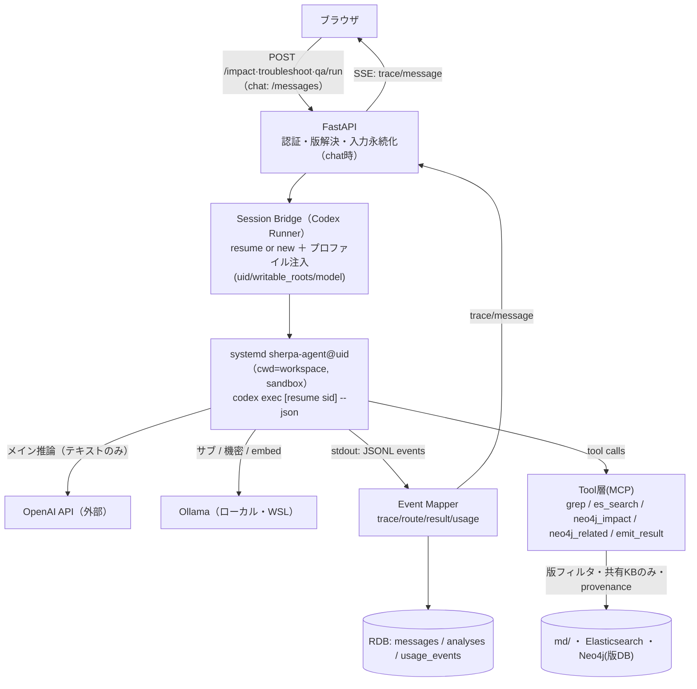
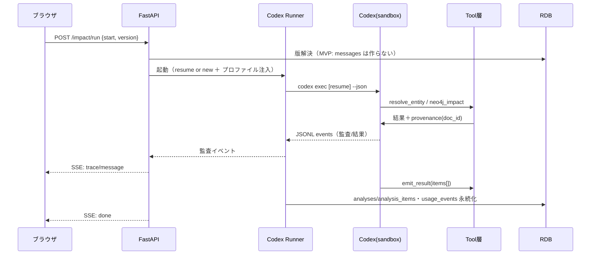

# FastAPI ⇔ Codex セッションブリッジ（実装の心臓部）

> **⚠ 2026-06-28 同一性/範囲は [03-鏡モデル.md](03-鏡モデル.md) が一次情報・移行完了**。本書 tool contract の
> `@version` 表記・`version` フィルタは**`world_id + scope_prefixes` ＋ パス修飾 ID へ置換済**（DL は rel_path 基準）。矛盾時は [03-鏡モデル.md](03-鏡モデル.md) を優先。

> FastAPI と Codex CLI のセッション管理の実装詳細。**DB を基準**に Codex CLI をヘッドレス駆動し、
> 実行トレース（調査ログ）を SSE 配信、結果を `analyses`/`analysis_items` に落とす。
> 前提: 権限/サンドボックス＝[08-実行権限と隔離.md](08-実行権限と隔離.md)、データ＝[07-データモデル.md](07-データモデル.md)、
> グラフ＝[05-グラフ語彙.md](05-グラフ語彙.md)。

## 0. 責務境界
| コンポーネント | 責務 | 持たない責務 |
|----------------|------|--------------|
| **FastAPI（API層）** | 認証/認可、会話・台帳(RDB)、版スコープ解決、SSE配信、共有 | 推論・検索の実行 |
| **Session Bridge（Codex Runner）** | Codex の起動/`resume`、イベント受信、永続化、回復 | UI・ビジネス判断 |
| **Event Mapper** | Codex `--json` イベント → trace/route/result/usage へ変換 | — |
| **Tool 層（MCP）** | grep / ES / Neo4j / 結果emit。版・スコープ強制 | 経路の選択（＝Codexが選ぶ） |
| **Codex CLI** | エージェント本体（経路選択・推論・ツール呼び出し） | 認証・台帳・キー保持 |

**鍵**: 検索（grep/ES/Neo4j）は**ツール**としてエージェントに渡す（生シェルにDBを開けない＝
[08-実行権限と隔離.md](08-実行権限と隔離.md) §4）。Codex が経路を選び、ツールが版/スコープを強制する。

## 1. 構成



## 2. 会話継続モデル（決定: ハイブリッド）
- **DB が基準**。`messages` が表示・監査の唯一の真実。
- **Codex セッション**（ローカルの rollout）は**継続のキャッシュ**。`conversations.codex_session_id`
  を保持し、`codex exec resume <sid>` で文脈を引き継ぐ（OpenAI の保持に依存しない＝§6）。
- **回復（rebuild）**: rollout が消失/破損/別ホスト等で resume 不能なら、**DB履歴から再構築**。
  直近メッセージ＋キー状態（版・security_mode・進行中の分析）を**圧縮した priming**で
  新セッションを起こし、`codex_session_id` を更新。→ DB を基準に保つ耐障害設計。

| 状況 | 動作（実測: Codex 0.139.0） |
|------|------|
| 新規会話 | `codex exec --json` → `thread.started.thread_id`(UUID) を `codex_session_id` に保存 |
| 継続 | `codex exec resume <thread_id> --json "<prompt>"` |
| resume 不能 | DB から priming して新セッション → `codex_session_id` 差し替え（残論点3 対応） |

> **実測**: `codex_session_id` ＝ `thread_id`（UUID）。`--ephemeral` を付けるとセッション非永続（resume 不可）
> → MVP `/impact/run` の単発実行に。chat は付けず resume 可能に。`--skip-git-repo-check` で非 git の
> workspace でも実行可。

> **実装済み（2026-07-16・R1b）**: 本節の設計どおり `codex exec resume <thread_id>` を実装。セッション実体
> （`sessions/` の JSONL）は会話ごとの `users/{uid}/workspace/.codex-sessions/{cid}` に保持し、
> resume 失敗時（セッション消失等）は新規セッション＋**R1a の履歴 priming**（直近ターンの前置）へ自動
> フォールバックする（下の「resume 不能」行の「圧縮した priming」は、実装では要約でなく R1a の
> 直近ターン truncation をそのまま流用＝§12 残論点2 参照）。保持日数は管理者設定
> `codex_session_retention_days`（既定 0=無制限）でスイープ。実装＝`sherpa/providers/codex/provider.py`・
> `sandbox.py`（`_safe_codex_sessions_home`）・`sherpa/store/conversations.py`（`get_session_id`/`set_session_id`）。
> **既知の軽微ギャップ**: `SHERPA_CODEX_SANDBOX=0`（緊急避難経路）は常に `--ephemeral` 固定で resume 非対応
> （sid を保存すると次回サンドボックス復帰後の resume が永久に失敗するため意図的に非保存）。ask_user で
> ユーザ確認のため終了したターンも sid は保存されない（次ターンは新規セッション＋R1a priming）。

## 3. リクエストのライフサイクル
> 以下は**チャット経路（Phase 1）**。MVP `/impact/run` は messages を作らず、結果＝`analyses`、
> トレース＝SSE一時＋`analyses.trace`（下のシーケンス図直後の注記参照）。

1. **受信**: `POST /conversations/{id}/messages {text, version?, security_mode?}`（認証必須）。
2. **準備（FastAPI）**: 認可 → 版スコープ解決（明示＞推論＞最新・§8）→ **user message を永続化**（chat時） →
   当該ユーザーの workspace を可書きに紐付け → 起動パラメータ確定（uid, writable_roots,
   model 選択は security_mode 依存）。
3. **起動（Bridge）**: 該当 `sherpa-agent@uid` ユニットで `codex exec [resume <sid>] --json`。
   プロンプト＝user text（必要時 priming 付与）。
4. **ストリーム**: stdout の JSONL を逐次受信 → **Event Mapper** が変換 → **SSE で配信**しつつ
   `messages.trace` に逐次チェックポイント保存（再読込で復元）。
5. **完了**: assistant message・trace・`route`(R2) を永続化。構造化結果を `analyses`/
   `analysis_items` に落とす。`codex_session_id`／`updated_at` 更新。**`usage_events` 記録**
   （tokens/cost/provider/latency/status）。
6. **応答**: SSE を `done` で閉じる。



> **2経路の違い（実装者向け）**:
> - **MVP `/impact/run`（origin=api）**: **会話・messages を作らない**。結果は `analyses`/
>   `analysis_items`（`conversation_id`/`message_id`=NULL）。実行トレースは **SSE 一時配信＋
>   `analyses.trace` に保存**（messages.trace は使わない）。
> - **チャット（Phase 1, origin=chat）**: §3 のとおり user/assistant `messages` ＋ `messages.trace`。

## 4. 実行トレース＝調査ログ（SSE・監査イベント）
**保存・表示するのは内部推論ではなく、構造化された監査イベント**（版解決・起点解決・ツール呼び出し・
検索件数・根拠解決）。生の reasoning は**永続化しない**（任意でライブ表示のみ）。安定性・監査性・
再現性のため UI 名称も「**実行トレース／調査ログ**」に寄せる（§13 監査と一致）。
`codex exec --json` の JSONL イベントを写像する（**実測: Codex 0.139.0**）:

| `--json` イベント（実測） | 取り扱い |
|--------------------------|----------|
| `thread.started` { `thread_id` } | **`thread_id` ＝ `conversations.codex_session_id`** に保存（resume はこの UUID） |
| `turn.started` | ターン開始（監査イベント） |
| `item.completed` { item.type=`agent_message`, text } | 本文を SSE 配信＋永続 |
| `item.completed` { item.type=`reasoning` } | **生の内部推論は保存しない**（任意でライブ表示） |
| `item.completed` { item.type= コマンド/ツール系 } | `route` 更新（R2/R15）＋**監査イベント**（正確な type 値は要確認） |
| `item.completed` { 構造化結果 } | `analyses`/`analysis_items`（§7。`--output-schema` で最終形を強制可） |
| `turn.completed` { `usage` } | `usage_events`（`input_tokens`/`cached_input_tokens`/`output_tokens`/`reasoning_output_tokens`→cost） |
| `error` / 異常終了 | 失敗処理（`usage_events.status=error`） |

> **監査イベントの保存先**: origin=chat → `messages.trace` ／ origin=api(MVP) → `analyses.trace`（R8）。
> 版解決・起点解決・件数・根拠解決などの構造化ステップを保存（生 reasoning は保存しない）。

- **再接続**: 実行中の SSE 切断時は、保存済みトレース（chat: `messages.trace` / api: `analyses.trace`）
  から復元 → 以降を継続配信。

## 5. モデル分担（main/sub）と機密モード
- 既定: **サブ（ローカル Ollama, `--oss`）が検索・RAG クエリを下書き → メイン（OpenAI）が検証 →
  実行**（§6）。Codex のサブエージェント/プロファイル設定で表現。
- **`security_mode = local_only`（R11）**: 推論を **Ollama のみ**にルーティング。OpenAI を呼ばない
  （キー経路を通らないことを担保）。systemd 側で egress 二重遮断可（[08-実行権限と隔離.md](08-実行権限と隔離.md) §5）。
- キーは Codex プロセスが systemd creds から取得。**FastAPI はキーを扱わない**（§7）。

## 6. ツール層（検索経路・スコープ強制）
エージェントに渡すツール（MCP）。**経路選択はエージェント、強制はツール**:
- `grep_search(query)` … 共有 `md/`（Office/PDF由来）＋ **ソース原文 `src/`**（cobol/jcl/copybook・MD化しない）＋ 個人 `workspace/`。
- `es_search(query, version)` … ベクトル＋BM25。**共有KBのみ・version フィルタ**。
- `neo4j_impact(start, version, depth)` … 版DBで逆向き推移たどり（[05-グラフ語彙.md](05-グラフ語彙.md) §6）。**版内完結**。
- `neo4j_related(anchor, version, depth)` … 厳密な依存影響でなく**近傍**（`INVOKES`/`RELATES_TO`/`DOCUMENTS` 含む）。
  **トラブルシュート用**。
- `resolve_entity(term, version)` … 起点曖昧性解消（R3）。**業務名は Parameter と対応 DataItem を
  複数起点で返してよい**（`REALIZES` 橋とあわせ、コピーブック系譜への到達を保証・[05-グラフ語彙.md](05-グラフ語彙.md)）。
- `emit_result(type, items[])` … 構造化結果を返す仕様（§7）。
各ツールは **版・共有/個人スコープを強制**し、結果に **provenance（`doc_id` ＋ span/line）** を付けて返す
（ソースも台帳行なので doc_id で統一・[05-グラフ語彙.md](05-グラフ語彙.md) §3。→ 参照DL R6/R14、個人ファイルは RAG 引用元に出さない）。
- **scope（参照範囲）**: 各検索ツールは省略可能な `scope`（共有KB部分木＝`scope_path`）を受け、設定時は
  範囲を強制（UC-4・R23・**Phase 2**。MVP は未使用）。

## 7. 結果キャプチャ（決定: 構造化出力仕様）
散文を正規表現で拾わず、**`emit_result` ツール**でエージェントに構造化結果を返させる:
```jsonc
// impact の例（根拠DLは evidence[].doc_id。target_doc_id は使わない＝UC-2 専用）
{ "type":"impact", "version":"2025冬",
  "items":[ {"category":"機能","label":"請求書発行機能",
             "confidence":"sure","extraction_method":"static",
             "path":["TAX-RATE","税計算ルール","請求書発行機能"],
             "evidence":[{"doc_id":123,"span":[40,72],"text":"…"}]} ] }
```
→ `analyses`＋`analysis_items` に保存（R4/R5/R6/R12）。**根拠DL＝`evidence[].doc_id`**。
`target_doc_id`/`target_span` は **doc_check（UC-2）の対象文書**用（impact では NULL）。
**`type` はやりたいこと＝UC**: `impact`/`troubleshoot`/`qa`/`doc_check` が同じ仕様で型違い（MVP は impact＋薄い troubleshoot/qa）。
**実測**: 最終結果の形は `codex exec --output-schema <JSON Schema>` で強制できる（emit_result ツールと併用/代替可）。

## 8. 同時実行・キュー（決定: 会話単位で直列、MVPはin-process）
- **会話単位で直列**（1会話=1進行中ラン。`conversations` にラン用ロック）。
- **ユーザー/会話横断は並列**（`sherpa-agent@uid` プール、上限あり）。
- MVP は FastAPI 内の **async サブプロセス管理**＋ロック。規模拡大時に**ジョブキュー**
  （arq/RQ 等）へ。長時間ランは**バックグラウンド＋SSE購読**。

## 9. 失敗・回復
| 事象 | 動作 |
|------|------|
| session-not-found / rollout 消失 | rebuild（§2） |
| タイムアウト / Codex クラッシュ | 部分trace保存・`usage_events.status=error`・UI へエラー |
| サンドボックス書込拒否 | エラー提示（kb 書込等は設計上不可） |
| ツール失敗（ES/Neo4j 不達） | 経路フォールバック（grep 等）を提案、trace に記録 |

## 10. 認証・ID 伝播
- FastAPI が認証 → `SHERPA_UID`／workspace／role を解決。Codex は `sherpa-agent` として走るが
  **writable_roots を当該ユーザー workspace に限定**（cross-user 不可）。
- 管理API（UC-A）は `role=admin` を要求（**MVP は seed admin 1名**で `/ingest`・`/impact/run` を実行）。
  共有閲覧はトークン＋招待＋期限（§10）。

## 11. API（抜粋）
**MVP の入口は薄い専用エンドポイント**: `POST /ingest`・`GET /ingest/{id}/preview`・
`POST /ingest/{id}/publish`・`POST /impact/run`・`GET /impact/{id}`・`GET /impact/{id}/export.xlsx`・
`GET /documents/{id}/download`。**＋別のやりたいことの薄い probe**（read-only）: `POST /troubleshoot/run`・`POST /qa/run`。
**会話チャットAPI（下記）は Phase 1**。Codex Runner コア・`emit_result` 仕様は共通。

Phase 1 以降（フルチャット基盤）:
- `POST /conversations` / `GET /conversations` / `GET /conversations/{id}`
- `POST /conversations/{id}/messages` → **SSE**（trace/message/done）
- `GET /conversations/{id}/messages/{mid}/trace`（再現）
- `GET /analyses/{id}` / `GET /documents/{id}/download`（参照DL解決）
- `POST /share` / 管理: `/admin/usage` `/admin/ingest` `/admin/versions` …

## 12. 残論点（実装時に確認）
1. ~~Codex CLI 版差異~~ → **実機確認済み（Codex 0.139.0）**: `codex exec resume <thread_id> --json`、
   イベント＝`thread.started`/`turn.started`/`item.completed{type}`/`turn.completed.usage`、
   `--sandbox`/`-C`/`--add-dir`/`--oss --local-provider ollama`/`--output-schema`/`--ephemeral`/
   `--skip-git-repo-check`。**残: `item.completed` の type 値（reasoning/command/tool）の網羅と
   network 無効化の config キー**（§5・[08-実行権限と隔離.md](08-実行権限と隔離.md) で確認）。
2. ~~priming の圧縮方式~~ → **実装済み（2026-07-16・R1b）**: 要約は行わない。R1a の直近ターン
   truncation（対数＋文字予算の二重キャップ・`chat_service._history_pairs`）をそのまま resume 失敗時の
   フォールバック priming に流用する（別途の要約ロジックは持たない・§2 参照）。
3. **emit_result の遵守**: `--output-schema` で最終形を強制。中間ツールは別途バリデーション/再要求。
4. **トレース粒度と保存量**: trace の保存粒度・上限・ロールアップ。
5. **キュー化の閾値**: in-process から外部キューへ移す同時実行数。
