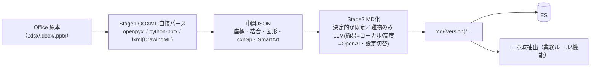
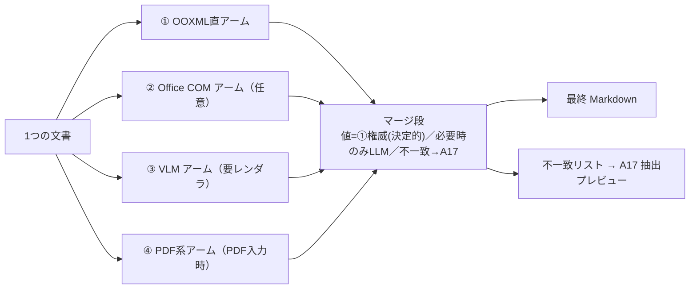

# 取り込み: Office/PDF → Markdown 変換（採用方式・改訂）

> **⚠ 2026-06-28 取り込み/範囲は [03-鏡モデル.md](03-鏡モデル.md) が一次情報・移行完了**。
> `md/{version}`・`src/{version}` の version 別ディレクトリ表記は**登録ディレクトリ（world）配下の1フォルダ木**へ置換済
> （MD化本文も world 内のパスで doc_id＝rel_path）。矛盾時は [03-鏡モデル.md](03-鏡モデル.md) を優先。

> Office も LibreOffice も無い前提で再検討（一次調査＋Codex 相談 job `office2md` で確定）。
> 方針: **レンダリングに頼らず、OOXML を直接パース → 中間JSON → 決定的に Markdown 化（既定）**。
> LLM は方眼紙/図/曖昧廃止/未変換などの**エスカレーション時のみ**（§2・§5.7）。
> 当初の ExStruct/xlwings 案（Excel COM 必須）は撤回。思想（構造保持→LLM→MD+Mermaid）は継承。
> 関連: [05-グラフ語彙.md](05-グラフ語彙.md) §4。

## 0. 検討マップ（このページの要約・論点・判断待ち）

**何を最適化するか**: **RAG の情報完全性（取りこぼし防止）＞ 見た目の再現・編集可能性**。

**検討の6軸**: ①目的・優先順位 ②変換方式 ③オブジェクト種別の扱い ④品質ゲート/レビュー ⑤規模・実行基盤 ⑥ソース連携(別スレッド)。

**確定（決まったこと）**:
- 方式＝**OOXML 直パース → (中間JSON) → Markdown**。**Office/LibreOffice 非依存・Linux-native**。
- 不採用＝LibreOffice（ずれる）／VLM全面（数値誤読＋要レンダ）／直テキスト化（構造喪失）。
- **アーム4種（プラグイン式）**: ①OOXML直(既定=値の権威) ②Office COM(任意=高忠実) ③VLM(ラスタ画像) ④PDF系(PDF入力)。
- **オブジェクト種別の取り方**（§2.1）: ベクタ図=決定的／ラスタ画像=VLM／表=XMLで正確／**全列挙で silent drop ゼロ**。
- **廃止/隠し**（§5.5）: 消さず残しラベル。**明示廃止=`status=deprecated`（自動）／隠し=`status=hidden_candidate`（抜き取り監査）**。
- **マージ**: 値は OOXML にピン留め（LLMに作らせない）＋LLMで整形、不一致→A17。
- **LLM**: **プロバイダ/モデルは自由に切替（設定駆動）**。コスト最適＝**簡易処理=ローカル／高度処理=OpenAI**。
  OpenAI へは**テキストのみ・File 非アップロード**（決定3）。大半は決定的MD化で LLM 自体不要。
- **規模**（数十万件）: **決定的-first ＋ リスクベース・レビュー ＋ 並列バッチ**。
- **公開**: 確信度ベースで**自動公開**（人承認は必須にしない・D3）。A17＝抜き取り/低確信/問題報告の**任意監査**。

**判断（2026-06-25 決定）**:
| # | 判断すること | 決定 |
|---|------|------|
| D1 | **Office COM アーム** | **入れる**（プラグイン実装）。Office未導入のため**起動は想定/スタブで進める**。**全アームを有効/無効切替**可能にし、Office環境が出たら②を有効化 |
| D2 | **旧バイナリ(.doc/.xls)** | **受領あり（0にできない）**。**②Office COM を正式な旧形式ハンドラ**に。導入までは「要Office変換」保留 or テキストのみベスト・エフォート＋低信頼ラベル |
| D3 | **人ゲートの範囲** | 規模的に非現実的 → **原則 自動公開**（人承認を必須にしない）。A17 は**抜き取り/問題報告ベースの任意レビュー**に降格。フラグ品は「要確認」ラベルで自動公開、**確信度で RAG が減点** |
| D4 | **計算資源** | ローカルLLM＝**NVIDIA DGX Spark**（確保済・**現状NW未接続**）→ **設定可能エンドポイント(OpenAI互換/Ollama)として実装**、接続でき次第 有効化 |
| D5 | **MVPのMD変換範囲** | **①OOXML直のみの最小形**：本文/見出し/**表(値・結合)**＋ベクタ図の**テキスト関係記述**＋明示廃止の自動タグ。②③・複雑処理は**設定で無効**（後付け） |

> **実装スタンス**: 「物はあるが今は繋がっていない」依存（Office=②／DGX Spark=ローカルLLM）は、
> **設定可能な外部依存としてスタブ/想定で実装**し、接続でき次第 **フラグで有効化**。＝いまは
> **①OOXML直 ＋（任意）クラウドLLM** で進められる。
> ⑥ソース連携（静的解析）は別途決定済み: 生成COBOL＋View(BCI)、ベンダー固有の生成系ツールとの直接連携は将来（[05-グラフ語彙.md](05-グラフ語彙.md) §4）。

## 1. 原則
- **最優先＝RAG の情報欠落を防ぐ（完全性）**。**見た目の再現・編集可能性(可動性)は非目標**。
  数値/本文/表データは**正確かつ完全に**、図は**"情報(ラベル・意味・関係)"を取りこぼさない**
  （Mermaid 化は**任意**＝できなければ LLM/VLM で図の内容を**テキスト記述**して残す）。
- **直テキスト化しない**（座標・結合セル・図形・接続の意味が落ちる）。
- **レンダリングエンジンに依存しない**（Office / LibreOffice / Gotenberg / Collabora は全て不可・OUT）。
  `.xlsx/.docx/.pptx` は **ZIP＋XML（OOXML）**なので、表も図形も **XML から直接読める**。

## 2. パイプライン（2段・Linux-native）
1. **Stage 1: OOXML 直接パース → 中間JSON**（レンダラ不要・Windows不要）
   - 表/セル/**結合セル**/座標/表範囲: `openpyxl`（xlsx）
   - **図形・コネクタ(`cxnSp`)・SmartArt(diagram parts)・アンカー・チャート**: DrawingML XML を `lxml` で直読み
   - `python-pptx`（pptx 図形）/ `python-docx`＋生XML（docx 本文＋DrawingML）
   - 候補ライブラリ: **Office Oxide**（Rust/Py・OOXML直・charts/images/関係を保持）も流用検討（残論点1）
2. **Stage 2: Markdown 化（規模対応で2経路）**:
   - **決定的レンダ（既定・LLM不使用）**: 単純本文・見出し・**標準表**は中間JSONから**テンプレートで MD 化**。
     数十万件の大半はここで完結（コスト/機密/時間リスク無し）。
   - **LLM エスカレーション（例外のみ）**: **方眼紙の複雑表・図/フローの意味化・曖昧な廃止・未変換オブジェクト**
     だけ LLM（**簡易=ローカル/高度=OpenAI**・設定で切替）。フロー/関係は Mermaid or テキスト記述。**エスカレーション条件は明文化**（§5.7）。

## 2.1 オブジェクト種別ごとの扱い（完全性優先・取りこぼし防止）
「廃止/隠し」だけでなく、**文書内の全オブジェクトに取り方を定義**する（情報欠落を防ぐ最優先と整合）。

| 種別 | 取りこぼし厳禁の情報 | 取り方（決定的-first ／ 例外で LLM・VLM） | 出力 | 主アーム |
|------|------|------|------|------|
| 本文・見出し | 文章・階層 | OOXML（`document.xml`/styles/numbering） | MD 段落・見出し | ① |
| **表（Excel）** | セル値・**結合**・ヘッダ・複数シート | `openpyxl`（値/結合は正確）→MD表。**方眼紙の複雑構造は LLM で意味再構成**（値は①にピン留め） | MD表（＋必要なら正規化） | ①（+LLM） |
| **表（Word）** | 行/列・結合・ネスト表 | `python-docx`/`w:tbl` → MD表 | MD表 | ① |
| **ベクタ図形/フロー図/SmartArt** | ノード・**接続**・ラベル・向き | DrawingML/`cxnSp` から構造抽出 → **Mermaid or 関係のテキスト記述**（完全性優先なら記述で可） | Mermaid／箇条書きの関係 | ①（+LLMで記述化） |
| **図形/テキストボックス内の文字**（DrawingML `txBody`／旧VML） ★ | 図形・テキストボックスの**本文/ラベル**。**設計書では“本体”がここに入ることが多い**（図の構造化とは別＝“読む文字”） | **全 shape を列挙し `a:t` を抽出**（本文＋ヘッダ/フッタ＋Excel `xl/drawings`＋PPT 全スライド）。**アンカー座標で読み順を復元** | MD 本文（位置順） | ①（決定的・取りこぼし厳禁） |
| **補助テキストストリーム** | コメント/スレッドコメント・発表者ノート・脚注/文末脚注・ヘッダ/フッタ | 各 part を抽出し**出所ラベル付き**で併記。footer の機密区分/版は**メタ化** | MD 注記ブロック＋メタ | ① |
| **チャート/グラフ** | 種別・軸・系列・**データ** | OOXML chart XML（データはそこにある）→ 表＋一文 | MD表＋説明 | ① |
| **ラスタ画像**（写真/スクショ/スキャン図） | 画像が伝える内容 | **VLM で説明/OCR**（機密はローカルVLM）＋ alt-text 併用。※**画素にしか情報が無い→VLM 必須** | テキスト記述 | ③（VLM） |
| 廃止/隠し | （§5.5）`status` 付与で残す | §5.5 のティア検出 | ラベル付き | ①（+②/③で検出補強） |

**設計原則**:
- **ベクタ vs ラスタの分岐が肝**: ベクタ（図形/SmartArt/フロー）は**構造が XML にある→決定的に取れる（VLM不要）**。
  **ラスタ画像は画素にしか情報が無い→VLM/OCR 必須**（機密はローカル）。
- **完全性の担保＝全オブジェクト列挙**: ファイル内の全 shape/image/table/chart を**列挙し、各々に必ず表現を割当て**。
  表現できない物は **`[未変換: 種別/位置]` と印を付けて A17 へ**（**silent drop ゼロ**）。
  **特に図形/テキストボックス内の文字は設計書の“本体”になりがち＝最優先で本文化**（diagram 構造化とは別に必ず拾う・PPT は全テキストが図形）。
- **数値はピン留め**: 表/チャートの数値は **①(XML) を正**、LLM に作らせない（ハルシネーション防止）。
- 図は完全性優先なので「**Mermaid 化できれば良いが、無理なら関係をテキストで列挙**」で情報は残す。
- **網羅範囲は part 単位で確定（§2.1.1）**: コメント・脚注・ヘッダ/フッタ・変更履歴・数式・ハイパーリンク・
  OLE/埋め込み・フォームコントロール・名前定義/外部リンク/非表示シート・プロパティ 等を、Word/Excel/PPT 別の
  **OOXML part カバレッジ表**（§2.1.1）で「抽出/メタ化/未変換タグ/対象外」に割り当て済み。
- **要素/チャンクのメタ**: MD 要素・チャンクに `extraction_method`・`numeric_verified`・`confidence` を保持し、
  **PDF/VLM 由来の数値は RAG で減点/警告**できるようにする。

### 2.1.1 OOXML part カバレッジ表（決定・silent-drop ゼロ）
全 part に扱いを割当てる。扱い＝**抽出**(MD本文)／**メタ化**(台帳・チャンクのメタ)／**未変換タグ**(`[未変換:種別/位置]`→A17)／**対象外**(無視)。
**共通ルール**: `docProps/*`→メタ化 ／ `vbaProject.bin`→対象外(印 `has_macros`) ／ ラスタ画像→③VLM(arm) ／ OLE 埋め込み→再帰抽出 or `[未変換]` ／ 隠し→`hidden_candidate`(§5.5) ／ 数値の不一致・未計算→`要確認` ／ ハイパーリンク・外部リンクは**依存辺候補**として静的に拾う（[05-グラフ語彙.md](05-グラフ語彙.md)）。

**Word (.docx / .docm)**
| part / 機能 | 中身 | 扱い | 落とし先・印 |
|---|---|---|---|
| `word/document.xml` | 本文・見出し・段落・表 | 抽出 | MD本文 |
| 図形/テキストボックス(`w:drawing`/`wps:txbx`/旧VML) ★ | 図形内の文字（設計書の本体になりがち） | 抽出 | MD本文（座標で読み順） |
| `w:tbl`（表・ネスト表） | 行/列/結合 | 抽出 | MD表 |
| 変更履歴(`w:ins`/`w:del`/`w:move*`) | 改訂 | 抽出（採用版）＋差分 | MD＋`要確認` |
| 隠し文字(`w:vanish`) | 視覚的に隠した文字 | 抽出＋隠し | MD＋`hidden_candidate` |
| `comments`/`commentsExtended` | レビュー注記（スレッド） | 抽出 | MD注記（出所ラベル） |
| `footnotes`/`endnotes` | 脚注/文末脚注 | 抽出 | MD注記 |
| `header*`/`footer*` | 機密区分・版・文書番号 | 抽出＋メタ化 | MD注記＋台帳メタ |
| フィールド(`w:fldSimple`/`instrText`) | TOC/REF/DATE/DOCPROPERTY 等 | 抽出（結果値） | MD（リンクは依存辺） |
| ハイパーリンク(rels) | 文書/システム参照 | 抽出 | **依存辺候補** |
| 数式(OMML `m:oMath`) | 数式 | 抽出（テキスト/LaTeX化） | MD（数式） |
| コンテンツコントロール(`w:sdt`)/フォーム | 入力値 | 抽出 | MD |
| 画像(raster `word/media`) | 画素情報 | ③VLM＋alt-text | テキスト記述 |
| `word/embeddings`(OLE) | 埋め込み Excel/PDF 等 | 抽出（再帰）or 未変換タグ | MD or `[未変換]` |
| `docProps/core`,`custom` | 作者/版/機密区分/承認 | メタ化 | 台帳メタ |
| `numbering`/`styles`/`sectPr` | 見出し階層・段組 | 内部利用 | （構造に反映） |
| `vbaProject.bin` | マクロ | 対象外 | 印 `has_macros` |
| theme/fonts/settings | 体裁 | 対象外 | — |

**Excel (.xlsx / .xlsm)**
| part / 機能 | 中身 | 扱い | 落とし先・印 |
|---|---|---|---|
| `worksheets/sheetN.xml` | セル値・結合・座標 | 抽出 | MD表（値ピン留め） |
| `sharedStrings.xml` | 文字列プール | 内部利用 | （値解決） |
| 数式＋キャッシュ値(`f`/`v`) | 式と計算結果 | 抽出（cached値）／未計算は要確認 | 値＋`要確認` |
| セル書式(`numFmt`) ★ | 単位（10 vs 10% vs ¥） | 抽出（値解釈に必須） | 値メタ |
| 非表示/`veryHidden` シート | 隠しシート | 抽出＋隠し | MD＋`hidden_candidate` |
| 非表示 行/列・行高0・フィルタ非表示 | 隠し行列 | 抽出＋隠し | MD＋`hidden_candidate` |
| `drawings/drawingN.xml` ★ | 図形/テキストボックスの文字・コネクタ・SmartArt | 抽出（文字）＋構造 | MD本文／Mermaid |
| `charts/chartN.xml` | 種別・軸・**系列データ** | 抽出（データ） | MD表＋説明 |
| `pivotCache`＋`pivotTables` | ピボット元データ・集計 | 抽出 | MD表 |
| `comments`/`threadedComments` | 注記 | 抽出 | MD注記 |
| `externalLinks` | 別ブック参照＋cached値 | 抽出 | **依存辺候補** |
| `connections`/Power Query | 外部DB/ファイル接続 | 抽出 | **依存辺候補** |
| `definedNames` | 名前付き範囲（例 `TAX_RATE`） | 抽出 | Parameter候補/メタ |
| `dataValidation` | ドロップダウンの許可値 | 抽出 | コード値候補/メタ |
| 画像(raster `xl/media`) | 画素情報 | ③VLM | テキスト記述 |
| `xl/embeddings`(OLE) | 埋め込み | 抽出（再帰）or 未変換タグ | MD or `[未変換]` |
| `docProps/core`,`custom` | 版/機密区分 等 | メタ化 | 台帳メタ |
| ハイパーリンク | 参照 | 抽出 | 依存辺候補 |
| ActiveX/フォームコントロール | 値はあれば抽出 | 抽出/対象外 | MD/— |
| `vbaProject.bin` | マクロ | 対象外 | 印 `has_macros` |

**PowerPoint (.pptx / .pptm)**
| part / 機能 | 中身 | 扱い | 落とし先・印 |
|---|---|---|---|
| `slides/slideN.xml`（`p:sp`/`p:txBody`）★ | **スライドの全テキスト＝図形内**（PPTは本文がほぼここ） | 抽出 | MD本文（座標で読み順） |
| `notesSlides/notesSlideN.xml` | 発表者ノート | 抽出 | MD注記 |
| 非表示スライド(`show=0`) | 隠しスライド | 抽出＋隠し | MD＋`hidden_candidate` |
| 画面外/枠外の図形 | スライド外に逃した文字 | 抽出＋隠し | MD＋`hidden_candidate` |
| 表(`a:tbl`)/グラフ | 行列・系列データ | 抽出 | MD表 |
| SmartArt/図形/コネクタ | 文字＋構造 | 抽出（文字）＋構造 | MD本文／Mermaid |
| `comments` | 注記 | 抽出 | MD注記 |
| `slideMasters`/`slideLayouts` | テンプレ定型文 | 対象外（プレースホルダの実テキストは抽出） | — |
| 画像(raster `ppt/media`) | 画素情報 | ③VLM | テキスト記述 |
| `ppt/embeddings`(OLE) | 埋め込み | 抽出（再帰）or 未変換タグ | MD or `[未変換]` |
| メディア（動画/音声） | 再生物 | 対象外（ファイル名のみメタ） | 台帳メタ |
| ハイパーリンク | 参照 | 抽出 | 依存辺候補 |
| `docProps/core`,`custom` | 版/機密区分 | メタ化 | 台帳メタ |
| アニメ/トランジション/タイミング | 演出 | 対象外 | — |
| `vbaProject.bin` | マクロ | 対象外 | 印 `has_macros` |

> **MVP 範囲**: ①OOXML 直で「抽出/メタ化/未変換タグ/対象外」を実装。`pivotCache`/`externalLinks`/OLE 再帰など重い part は **`[未変換]` タグ＋A17 で段階対応**してよい（silent-drop しないことが要件）。依存辺候補（ハイパーリンク/外部リンク）は [05-グラフ語彙.md](05-グラフ語彙.md) の抽出に接続。

## 3. 対象フォーマット別
| 種別 | 方式 |
|------|------|
| **Excel(.xlsx)** | OOXML 直: セル/結合/座標＋drawingml 図形 → JSON → **決定的MD**（複雑表/図のみ LLM） |
| **Word(.docx)** | OOXML 直: 本文/表/styles＋DrawingML 図形 → JSON → **決定的MD**（図のみ LLM/記述） |
| **PowerPoint(.pptx)** | `python-pptx`＋drawingml: スライド/図形/コネクタ/ノート → JSON → **決定的MD**（図のみ LLM/記述） |
| **マクロ付き(.xlsm/.docm/.pptm 等)** | **取り込み対象**。上記と同じ OOXML 直で content を取る。**VBA(`vbaProject.bin`)は取得しない・実行しない**（Linux 直読み＝マクロ実行リスク無し）。マクロ実行で初めて入る動的値のみ `要確認` |
| **PDF（既存PDF/スキャン）** | **ティア制**（一律解なし・下記）。Office と違い数値が抽出/推論で精度差 |
| **COBOL/JCL/Copybook** | 変換しない（plain text）。静的解析 S が直読み |
| **旧バイナリ(.xls/.doc/.ppt)** | OOXML ではない＝XML 直読み不可。**新形式で受領**を原則。⚠ LibreOffice 変換は**座標がずれて焼き付く**ため構造抽出に使わない（下記） |

### 3.1 拡張子カタログ（拡張子 → 扱い・決定）
実コーパスは Office/ソース以外も混在するため、全拡張子に扱いを定義する。

**分類の判定軸（4種）** — 拡張子だけでなく content sniff も併用し、下記に振り分ける:
| 種類 | 例 | 扱い |
|---|---|---|
| **プログラム/スクリプト ソース** | COBOL/JCL/Copybook ＋ `.sh/.bat/.ps1/.py/.pl/.sql` | `src/`＋**静的解析**（呼出・データアクセス・orchestration） |
| **構成/設定ソース(config)** | `pom.xml`/`web.xml`/`server.xml`/`.classpath` | `src/`＋**静的辺(Phase 2)** |
| **ドキュメント（人が書いた説明）** | 設計書/仕様/帳票/規約（Office） | OOXML→決定的MD＋L 意味層 |
| **ツール自動生成 IDE/ビルドメタ** | `.project`/`.settings`/`target/`/`node_modules/` | **既定スキップ**（設定で含め可） |
> 原則: **依存/配線を宣言するもの＝“ソース”** ／ **自動生成の雑多＝“スキップ”** ／ **人の説明＝“ドキュメント”**。

**共通原則**:
1. **拡張子を鵜呑みにせず content sniff**（マジックバイト: ZIP=`PK`／CFB=`D0CF11E0`／PDF=`%PDF`／画像シグネチャ）。拡張子と中身が食い違えば**中身を優先**。
2. **パスワード/暗号化/破損 → `requires_password`/`failed` 記録**（黙って落とさない）。
3. **未知拡張子 → sniff → テキストなら plain text 登録／判別不能なら `[未変換]`**（silent-drop ゼロ）。
4. **スキップ**（索引にも入れない・既定）: `~$*`（Office 一時ロック）・`Thumbs.db`・`.DS_Store`・`.bak/.tmp/.swp`・**ツール自動生成の IDE/ビルドメタ**（`.project`/`.settings`/`.factorypath`/`target`/`build`/`node_modules`/`.idea`/`.git` 等。**設定で含め可**）。

| 拡張子 | 種別 | 扱い（枝・方式） | 落とし先 |
|---|---|---|---|
| `.xlsx/.docx/.pptx`＋マクロ/テンプレ系 | Office 新形式(OOXML) | OOXML直→決定的MD（§2.1.1） | md/ |
| `.xls/.doc/.ppt`・`.xlk`(Excelバックアップ＝実体.xls) | Office 旧バイナリ(CFB) | 新形式受領原則／②Office COM(Phase2)。LibreOffice 変換は不可 | 保留 `requires_office` |
| `.xlsb` | バイナリ workbook(ZIP＋BIFF12) | **対象**：`pyxlsb` 等の専用ライブラリで値/構造を抽出→決定的MD（XML 直読みは不可） | md/ |
| `.txt/.md/.log/.csv/.tsv/.json/.xml/.yaml/.ini/.properties` | テキスト/データ | **plain text 登録(grep)**。csv/tsv は軽量MD表化可、`.md` はそのまま | src/ or md/ |
| `.sql` | DB定義/操作 | **ソース枝寄り**：DDL/DML を静的解析候補（CREATE→`Table`／SELECT→`ACCESSES`）＋plain text | src/＋静的解析 |
| `.cob/.cbl/.jcl/.cpy/.bci` 等 | ソース（プログラム） | src/ 登録＋静的解析S（§2.1 ソース枝） | src/ |
| `.sh/.ksh/.bash/.bat/.cmd/.ps1/.py/.pl/.rb/.js/.awk` 等 | スクリプト ソース | **src/ 登録＋grep（即）**＋静的解析候補（呼出/データアクセス/orchestration。**shell/batch は JCL 同様の辺**）。**実行しない** | src/ |
| `web.xml/server.xml/context.xml/pom.xml/build.gradle/.classpath` 等 | 構成/設定ソース(config) | **src/ 登録＋grep（即）**＋**静的辺は Phase 2**（servlet→endpoint／datasource→DB／依存宣言） | src/ |
| `.project/.settings/.factorypath/.launch`・`target/`/`build/`/`node_modules/`/`.idea/`/`.git/` | ツール自動生成 IDE/ビルドメタ | **既定スキップ**（索引に入れない・**設定で含め可**） | スキップ |
| `.msg`(Outlook/CFB)・`.eml`(MIME) | メール | 本文→MD／ヘッダ(from/to/subj/date)→メタ化／**添付は各タイプで再帰** | md/＋メタ（要判断） |
| `.pdf` | PDF | PDF ティア（§ PDF） | md/ |
| `.png/.jpg/.gif/.bmp/.tif/.webp` | ラスタ画像 | **対象**：③VLM/OCR で内容抽出（Phase 2、MVP は暫定 `[未変換]` で保持） | テキスト記述 |
| `.svg` | ベクタ画像 | テキスト/構造を決定的抽出 | md/ |
| `.emf/.wmf` | Windows メタファイル(ベクタ) | レンダラ無→`[未変換]` or 要レンダ VLM | `[未変換]`/③ |
| `.vsdx` | Visio 新(ZIP＋XML) | **対象**：図形/テキスト抽出（DrawingML 同様） | md/ |
| `.vsd/.mpp` | Visio 旧/MS Project(バイナリ) | **対象**：②Office COM/専用ツールで抽出（Phase 2、それまで暫定`[未変換]`で保持） | md/（Phase2） |
| `.odt/.ods/.odp` | OpenDocument(ZIP＋XML) | **対象**：ODF パーサで本文/表/図形を抽出→決定的MD（OOXML と同方式の別スキーマ） | md/ |
| `.rtf` | リッチテキスト | RTF パーサでテキスト抽出 | md/ |
| `.html/.htm/.mht` | Web/アーカイブ | 本文/表/リンク抽出→MD（リンク＝依存辺） | md/ |
| `.zip/.7z/.tar.gz/.lzh/.rar` | アーカイブ | **展開→中身を各タイプで再帰**（下記 規則） | 各タイプ |
| `.exe/.dll/.bin`・動画/音声・フォント・`.lnk` | 実行/メディア/その他 | **対象外**（メディアはファイル名のみメタ） | — |

**アーカイブの取り込み規則**: 展開 → **中身を各タイプで再帰**処理し、`documents` に**個別ファイルとして登録**
（来歴＝元アーカイブの `doc_id`＋内部パス）。**ネスト可**だが **展開の深さ・総サイズに上限**（zip 爆弾対策）。
**暗号化アーカイブ → `requires_password`**。OOXML/ODF/vsdx も ZIP なので **sniff で“文書”と判定し展開しない**。
junk（`__MACOSX`/`Thumbs.db`/`~$*` 等）はスキップ。

**決定（このプロジェクト）**:
- **メール(.msg/.eml)**: 共有KBに**含める**（本文＋ヘッダのメタ化＋**添付は各タイプで再帰**）。
- **その他 Office も全部対象**: `.xlsb`／Visio `.vsd(x)`／Project `.mpp`／OpenDocument `.od*`。
  **ZIP+XML 系（.vsdx/.od*）は直接抽出**、`.xlsb` は専用ライブラリ、**旧バイナリ（.vsd/.mpp）は ②Office COM/専用＝Phase 2**（それまで暫定 `[未変換]` で保持＝落とさない）。
- **単独ラスタ画像も対象**：③VLM で内容抽出。MVP は VLM 無効のため**暫定 `[未変換]` で保持**（落とさない）、Phase 2 で抽出。
- **スクリプト（.sh/.bat/.ps1/.py/.sql 等）＝ソース**：`src/`＋grep（即）、静的解析候補（shell/batch は JCL 同様の orchestration 辺）。**実行しない**。
- **config（Eclipse/Tomcat 等：web.xml/server.xml/pom/.classpath）＝構成ソース**：`src/`＋grep、静的辺は Phase 2。
- **IDE/ビルドの自動生成メタ（.project/.settings/target 等）＝既定スキップ**（設定で含め可）。

## 4. 構成・整合
- **実行場所: Linux-native（Windows/Excel 不要！）** ← 当初案からの最大の改善。取り込みワーカー
  （`sherpa-ingest`）が **WSL Linux でそのまま**動く。エージェントのサンドボックスとは無関係。
- **機密（決定3）**: Stage 2 を**ローカル LLM（Ollama）に振れる**。OpenAI へはテキスト（中間JSON）のみ・
  ファイル非永続で整合。
- **来歴**: 生成MDと原本の対応を `documents` 台帳（`md_path`/`doc_id`）で保持。
- **コスト**: 大半は**決定的MD化（LLM 0回）**。LLM はエスカレーション文書のみ（最大1回・取り込み時）。MVP 小コーパスは軽い。
- **品質ゲート**: 生成MD（表崩れ・Mermaid 妥当性）は A17 抽出プレビューの前段で確認可。

## 5. ツールの役割分担と「隠れ LibreOffice 依存」の注意（調査で判明）
### PDF 経路は「ティア制」（一律解なし）
Office と違い PDF は構造が確定していないので、タイプと**数値の正確さ**で選ぶ:
| ティア | 対象 | ツール | 注意 |
|---|---|---|---|
| ① 軽量 | デジタル・単純テキスト | **pymupdf4llm / MarkItDown** | 速い・**ハルシネーション無し**。まずこれ |
| ② 構造 | 複雑表・多段組・スキャン | **Docling**（候補）/ Marker | 決定的（OCR+表モデル）。重い(~2GB) |
| ③ 視覚 | 図/フロー主体・難スキャン | **マルチモーダル LLM(VLM)** | 最高忠実だが下記の致命的注意 |

- ⚠ **VLM の数値ハルシネーション**: 税率・金額・コード値を**静かに誤読**しうる。**数値クリティカルな文書では
  単独ソースにしない**（決定的抽出を主、VLM は図/レイアウト補助、数値は別途検証）。VLM は**コスト**＋
  **機密（ページ画像送信）→ ローカル VLM 必須**。
- → **設計の非対称**: Office 経路は数値が XML から確定＝安全。PDF-VLM は数値が推論由来＝リスク。

### Docling の立ち位置（Office には使わない）
- ネイティブ Office は **OOXML(XML) が正解データ**＝直読みの方が正確。Docling の表モデルは PDF 向け。
- ⚠ **Docling の DOCX DrawingML は LibreOffice を探索**（`DOCLING_LIBREOFFICE_CMD`）→ Office 図形用途で原則違反。
- → Docling は **PDF ティア② 専用の候補**（必須ではない。MVP は ① で足りる見込み）。

### その他
- **MarkItDown**: ⚠ **XLSX は pandas で表化＝構造を潰す**（Office 本命にしない。PDF/単純は軽量パスで可）。
- **unstructured**: ⚠ 旧 `.doc/.ppt` は LibreOffice 必須。
- **vision/PDF 経路**: **元から PDF/スキャン**の文書だけに限定（Office→PDF のレンダラが無いため主経路にしない）。
- **視覚完全再現が要る低信頼ケースのみ**: 商用 Linux レンダラ（Aspose/GroupDocs）で PDF/PNG 化 → 後段、は
  **有料判断**（既定では入れない）。無料OSSのみで Office/LO 無しの高忠実レンダリングは非現実的、が調査結論。

## 5.5 視覚的廃止（オブジェクトで隠す等）への対応 ⚠重要
設計書類には、**廃止機能を“図形で覆って”見た目だけ削除**している文書がある。OOXML は
**下の元テキスト/セルと、上の覆い図形を別々に格納**するため、**素朴な抽出は隠れた廃止機能を拾う**
→ RAG/影響分析が**廃止済みを生きていると誤認**する危険（品質に直結）。

- **OOXML 直は自動では“見た目の廃止”を尊重しない**が、**検出は可能**：覆い図形の座標
  （`xdr:from/to`）・塗り（`a:solidFill` 不透明度）・描画順(z) が DrawingML にあるので、
  **オクルージョン（重なり）判定**で「覆われたコンテンツ＝廃止候補」をマークできる。
- 皮肉だが **render/VLM 経路は「見たまま」を読む**ので、この一点は自然に正しい（疑わしい文書だけ
  VLM で下レイヤ抽出と差分照合、も可。ただし数値ハルシネーション注意）。
- 「視覚的廃止」の手口別検出難易度: 非表示行列(`hidden`)=簡単 / 行高0=中 / 白文字×白背景=中 /
  **図形オーバーレイ=最難**（幾何判定）。
  **as-built（2026-07-12）**: 図形オーバーレイ幾何判定は **pptx v1 実装済み・自動**
  （`office_md._pptx_md`。閾値90%・単一occluderのみ・人手確認UIなし＝下の `hidden_candidate`
  メタタグ方式でなく MD本文へ直接マーカー行を出す簡略版。他の手口・docx/xlsx の幾何は未実装）。
- **方針（完全性優先と整合）**: Stage 1 に**廃止/隠し検出**を入れ、**情報は消さず
  `status=deprecated`（明示廃止）/`status=hidden_candidate`（隠し）をメタ付与して残す**（落とすのでなく**区別**）。
  → 情報欠落ゼロ＋誤索引ゼロ。

### 廃止/隠しの検出ティアと RAG 挙動（設計書向け）
| ティア | シグナル | 検出 | 扱い |
|--------|---------|------|------|
| **高信頼＝明示廃止** | 取り消し線(`w:strike`)・「廃止/削除済/旧/obsolete」等キーワード・グレーアウト塗り | OOXMLで**確実** | **自動で `status=deprecated`** タグ |
| **低信頼＝隠し** | 図形オーバーレイ(幾何)・白文字×白背景・非表示行列(`hidden`)・行高0・**非表示/veryHidden シート**・**非表示スライド(`show=0`)**・**隠し文字(Word `vanish`)**・**画面外/キャンバス外の図形** | 幾何/属性/比較（曖昧） | `status=hidden_candidate` タグで**自動公開**（保留しない）＋**抜き取り監査**（D3） |

- **RAG/影響分析の挙動**: 「現状」を問う検索・影響分析では **`deprecated`／`hidden_candidate` を既定で除外/減点**（廃止が"生きている"
  として出ない）。ただし**ラベル付きで保持**しているので「なぜ廃止されたか/旧仕様」を問えば出せる。
- **影響分析グラフ**: 廃止/隠しノード/関係は `status=deprecated`／`hidden_candidate`（[05-グラフ語彙.md](05-グラフ語彙.md) §3）を持ち、**両方とも active な修正対象から既定で外す**
  （廃止の事実は参照可能）。
- **規模整合**: 高信頼は**自動タグ**、低信頼の曖昧分だけ**サンプリングで人確認**＝数十万件でも回る。

## 5.6 複数変換のマージ（アンサンブル）— 採用しうる発展形

> **用語定義「アーム（arm）」**: 1つの文書を Markdown 化する**変換ルート（手法）の1本**。
> 複数アームを並行に走らせ、最後の**マージ段**で1つの最終MDに統合する（値は権威アームに固定、
> 不一致は A17 へ）。アームは**差し替え可能（プラグイン式）**で、文書種別や利用可能な環境
> （Office の有無等）に応じて 1..N 本を選ぶ。

各手法は相補的なので、**複数アームを走らせ、最後に照合マージ**して最終MDを作る構成が有効。

### 現在想定しているアーム（4種）
| アーム | 目的・意図 | 強み | 弱み・前提 | 位置づけ |
|--------|-----------|------|-----------|---------|
| **① OOXML 直** | XML を直接読み、**値・セル・構造・図形(DrawingML)を正確に**取る | 数値/構造が正確・**レンダリング無し=ずれ無し**・Linux-native | 隠しレイヤを拾う(§5.5)・図形→Mermaidは自作・旧バイナリ不可 | **既定・"値の権威"**（MVP） |
| **② Office COM** | 本物 Office で**忠実な変換/レンダ/フル図形抽出**（旧→新・PDF・図形） | 最高忠実・**ずれ無し**・legacy可・**as-displayed**取得 | Office必須(Windows)・サーバCOM不安定・ライセンス・セキュリティ | **任意の高忠実アーム・"可視性の権威"**（Phase2/任意） |
| **③ VLM（視覚）** | 画像を見て**「見たまま」**をMD化。図・視覚的廃止に強い | as-displayed・図/レイアウト理解 | **数値ハルシネーション**・要レンダラ・コスト・機密 | 図/可視性の**補助**（Phase2・要レンダラ） |
| **④ PDF系**（Docling / pymupdf4llm / MarkItDown） | **元から PDF/スキャン**の文書を処理（§5「ティア制」） | 複雑表/スキャン(Docling)・軽量(pymupdf) | PDF専用・Office不可 | **PDF入力時**（必要に応じ） |

- **マージの権威**: 値・数値・構造＝**①**、可視性＝**②** or **③**、図＝**①(DrawingML→Mermaid)** or **②/③**。不一致→A17。
- **入手性（現状）**: ①=可（Linux）／②=**要 Office 導入**（現環境は未インストール）／③=**要レンダラ**（②か native PDF）／④=PDF入力時。

- **権威ルール**: 数値・セル・本文は **OOXML を正**（**マージLLMに値を再生成させない**＝ハルシネーション防止）。
  可視性/レイアウト＝VLM、図＝OOXML-DrawingML→Mermaid（or VLM）。
- **不一致＝検出シグナル（最大の収穫）**: 「OOXMLに有る×VLMで見えない」＝**視覚的廃止候補**（§5.5）／
  数値の食い違い＝OCR・隠しの疑い → **A17 で人確認**（確信度に反映）。
- **⚠ LibreOffice レンダの二重不確実性**: LibreOffice の版面は MS Office と異なり**オブジェクトがずれる**
  （実体験あり。旧→新変換時にずれが OOXML に焼き付き、PDF にも継承）。LibreOffice レンダ画像を VLM に渡すと
  「**ずれ＋ハルシネーション**」で二重に不確か → **VLM が信頼できるのは原アプリ製 native PDF のみ**。LO レンダは権威にしない。
- **⚠ 制約**: VLM アームは**レンダリング必須** → Office/LibreOffice 無しでは Office を画像化できない。
  よって VLM が入るのは「元から PDF」「商用レンダラ導入時」「OOXML-DrawingML の**幾何オクルージョン**で
  可視性を代替」のいずれか。**純 Office（レンダラ無し）では実質「OOXML＋幾何オクルージョン」のマージ**（Docling は ④PDF入力専用）。
- **段階**: 設計は**プラグイン式コンバータ＋マージ段**（アーム差し替え可）。MVP は **OOXML 単独（＋隠し幾何検出）**、
  **VLM アーム/フルマージは Phase 2**（レンダラが使える文書サブセット・検証用途から）。コストは取り込み時のみ。

### Office COM（Windows 側・任意の"高忠実アーム"）
WSL ホストは Windows なので、**本物の MS Office を入れれば Office COM が使える**（COM は Windows 技術なので
**Windows 側で実行**＝WSL がそのサービスを呼ぶ。ingest 限定で Linux コアとは分離）。本物の版面エンジンなので:
- **旧→新変換が忠実**＝**legacy バイナリ問題が解決**（LibreOffice のずれが無い）。
- **PDF レンダが忠実**（`ExportAsFixedFormat`）＝VLM に渡す画像が native 品質で**ずれない** → VLM アームが信頼可。
- **xlwings/COM でフル図形抽出**（ExStruct フルモード相当・座標も忠実）。
- マージでは **可視性の権威（as-displayed）＝LibreOffice 不採用の代替**、legacy 変換器、フル図形抽出器として差す。

⚠ **罠**: (1) Office ライセンス。(2) **サーバサイド Office 自動化は MS 公式非サポートで不安定**
（ダイアログ/ハング/プロセスリーク/**並列不可・直列**）→ 厳格なタイムアウト・監視・再起動。
(3) **セキュリティ**: 本物 Office で任意文書を開く＝マクロ/エクスプロイト面 → マクロ無効・保護ビュー・**隔離 Windows VM**。
(4) Windows 依存の部分的再導入（ingest 限定）。

**判断**: legacy が多い／忠実レンダ(VLM)が要るなら導入価値大。ほぼ modern OOXML なら不要（OOXML 直で十分）。
**推奨＝ハイブリッド**（OOXML 直を既定 ＋ Office COM を任意アーム）。

**実装境界（決定・コンテナ問題を構造的に塞ぐ）**: ②Office COM は **単一の PowerShell スクリプト**
（`deploy/office-com-worker.ps1`）に閉じ込め、`powershell.exe`／COM interop に触れるのは **このスクリプト1つだけ
＝interop の唯一の境界**。Linux/WSL コアは COM を直接叩かない。呼び出し形態は **2つ**（W2'・2026-07-08・ユーザー
決定「同一マシンではワーカーなどスクリプト無しで動く想定」）:

- **direct（既定・同一マシン）**: WSL の interop（`/mnt/c/.../powershell.exe`）で ps1 を **one-shot 実行**する
  （常駐ワーカー・URL・共有トークン不要＝Windows 側の事前準備ゼロ）。変換/レンダ1件ごとに ps1 を隔離子プロセス
  として起動し、タイムアウト時に「この変換が作った Office」だけを Windows 側で kill する（HTTP ワーカーと同じ堅牢性）。
- **http（別ホスト）**: Windows の**独立した常駐ワーカー**として ps1 を起動し、Linux コアは **HTTP で呼ぶ**
  （`POST /convert`／`POST /render`・`SHERPA_OFFICE_COM_URL` 設定時）。別マシンの Office を使う／WSL でない
  Linux ホストから使う場合の選択肢。

→ どちらも COM interop は ps1 に隔離され、Linux コア（**ホスト固定・恒久**・[08-実行権限と隔離.md](08-実行権限と隔離.md) §0.5）
とは疎結合（コンテナから powershell を叩く設計は採らない・direct は WSL interop 前提でホスト直の場合に成立）。
これにより「コンテナから Windows interop が使えない」問題は**設計で解消**。~~着手は Phase 2、MVP は無効。~~
W0（LibreOffice）／W1（http ワーカー）／W2'（direct one-shot＋PDF レンダ）実装済み（2026-07-08）。
デプロイ境界の決定（DB-only コンテナ／アプリはホスト恒久）は [08-実行権限と隔離.md](08-実行権限と隔離.md) §0.5。

## 5.7 変換パイプラインの設計（マージ／有効・無効／バッチ／LLM選択）

### (1) マージ段の設計 — 「決定的ピン留め ＋ LLM 統合レンダ」の2層
- **層1：決定的フィールド割当（LLM不使用）**。値・数値・セル・構造は **① OOXML から逐語コピー＝ピン留め**。
  **中間JSONを正式スキーマ化**し、各ピン留め要素に **`elem_id`・`value_hash`・単位/書式** を持たせ、出力MDと
  **対応表（elem_id→MD位置）** を残す。
- **層2：LLM 統合レンダ（使う場合のみ）**。ピン留め骨格＋各アーム出力を渡し、散文・レイアウト・図→Mermaid を生成
  （**ピン留め値は不変**と指示）。**LLM を使う文書は 1回**（§2 のエスカレーション対象のみ。単純文書は決定的レンダで LLM 0回）。
- **値検証（機械チェック・必須）**: レンダ後に **全ピン留め値が `value_hash` 一致で保持されたか／未出典の数値が増えて
  いないか** を検証。**失敗時は自動公開しても `要確認` 強制＋RAG減点**（ハルシネーションを実装で封じる）。
- **不一致検出（決定的 diff）**: OOXMLテキスト vs ②/③の可視テキスト →「OOXMLに有り×可視に無し＝**視覚的廃止候補**」
  「数値不一致」等を `conflicts[]` 化 → **A17 抽出プレビューへ**。
- **出力**: `final.md` ＋ `conflicts[]`（A17）＋ provenance（どのアーム由来か・監査）＋ 要素ごと confidence
  （複数アーム一致=高 / 単一・不一致=要確認 → ●/○）。
- **権威フォールバック**: 有効アームに応じ、可視性権威＝**②→③→（無ければ①の幾何オクルージョン）**と段階縮退。

### (2) アームの有効/無効（プラグイン式・設定駆動）
- 設定で各アームを **on/off ＋パラメータ**（例 `office_com.endpoint` / `vlm.provider` / `pdf.tier`）。
- スコープ: **グローバル / KB / 取り込みラン単位**。doctype ルーティング（PDF→④、xlsx→①(+②)、…）も設定で。
- 実行ランは `ingest_runs` に**使用アーム・プロバイダを記録**（再現・provenance）。merge は**存在するアームだけで成立**（フォールバック）。

### (3) バッチ処理（非同期・キュー）
MD変換は重い（LLM/COM/VLM）ので**取り込みは同期せず非同期バッチ**。**1文書=1ジョブ**のキュー（arq/RQ/DB-backed）。
- **アーム別ワーカーと並行度**:
  - ① OOXML（Linux/CPU）= **並列可**
  - ② Office COM = **直列**（Office 単一インスタンス・COM 不安定）＝Windows 側の**単一並行ワーカー**＋タイムアウト/再起動
  - ③ VLM（ラスタ画像）= **ローカル throughput 律速**（**local-only 固定**・OpenAI へ画像は送らない＝決定3）
  - merge/名寄せ等の **text/JSON LLM** = **プロバイダ律速**（ローカル throughput／**高度処理時のみ** OpenAI rate limit）
  - ④ PDF（Docling）= 並列可（GPU/CPU）
- **文書ごとの DAG**: アーム（一部並列）→ merge → `ingest_runs.extraction_snapshot`（staging）→ 自動公開（A17は任意監査）。
- 進捗は `documents.status`/`ingest_runs.status`＋**トラック別**（admin-ingest A12）。失敗アームは degrade/retry、checksum 重複排除。
- MVP は軽量キュー or in-process（小コーパス）、規模拡大で外部キューへ（[10-Codexブリッジ.md](10-Codexブリッジ.md) §8 と同方針）。

### (4) LLM プロバイダ選択 — **プロバイダ/モデルは自由に切替（設定駆動）・複雑度で振り分け**
- **OpenAI も利用可**（テキスト送信可）。ただし **OpenAI への File アップロードは不可**（Files API 不使用・
  **本文テキスト/構造化JSON のみ送信**・決定3）。
- **コスト最適化＝複雑度で振り分け**: **簡易処理（標準表・本文の整形等）はローカル**、**高度処理（複雑な
  方眼紙の意味再構成・難しい図/廃止判断等）は OpenAI**。大半は決定的MD化で **LLM 自体不要**。
- **自由に切替**: `llm_endpoints` で provider/model/base_url を定義。**text/JSON タスク（merge/名寄せ等）は複雑度ティアで割当**
  （simple→ローカル ／ advanced→OpenAI）。**③VLM は local-only 固定**（プロバイダ切替の対象外・OpenAI へ画像を出さない）。
  実行ランは `ingest_runs.llm_endpoint` に記録。
- **ローカル環境＝NVIDIA DGX Spark**（確保済・大型モデル可）。**現状 NW 未接続** → 接続でき次第 有効化（D4）。
  接続までの間は、ローカルティアも **非機密のみクラウドで暫定**可。
- **機密の扱い**: テキスト送信は決定3 の範囲で可（**既定は通常ルーティング**＝高度処理は OpenAI へ text のみ）。
  **機密の強制ローカルは `local_only`(R11) で可＝設計済み・既定OFF・MVP範囲外（Phase 2、区分による振り分けは将来拡張の方針と整合）**。
- **③VLM（視覚読み取り・アーム `markitdown_ocr`）**: 画像の視覚読み取り先は**展開（デプロイ先）ごとのポリシー
  設定**に従う（決定3 の修正・2026-07-08 ユーザー決定）。**既定＝ローカル（Ollama の視覚モデル）**で処理する。
  **クラウド視覚モデル（OpenAI）への送信は `system_settings.vlm.cloud_allowed`（管理者設定・監査つき）で
  展開ごとに許可する**。画像をクラウドへ送ること自体は方針として承認済みだが、展開先（社内 LAN 限定/機密度
  等）により要件が異なるため、**既定 false は配布時の安全側の初期値**であり「送信自体が禁止」という意味では
  ない（許可すると provider=openai の設定で実際に画像を OpenAI へ送る。設定画面に注意文言あり）。cloud_allowed
  が false のままだと provider=openai の設定は送信前に無効化される（実装は送信直前に許可を再読みして反映・
  stale な設定のまま送り続けない）。ローカル（Ollama）を社内ネットワークの別ホストで使う場合も同様に、
  接続先が IP アドレス（ループバック/RFC1918 私有アドレス帯）なら許可不要・ドメイン名は cloud_allowed が
  要る（DNS 解決先を保証できないため）。数値は VLM ハルシネーション注意（`numeric_verified=false`・数値
  クリティカル文書で単独ソースにしない）。tesseract 直の `ocr` アーム（「LLM を使わない軽量代替」）は
  **撤去した**（2026-07-08 ユーザー指示・視覚読み取りは markitdown_ocr（VLM）に一本化）。
  なお `pypdf`（PDF テキスト層抽出）・`markitdown[all]`（汎用MD化＋視覚読み取りの下地）は
  `requirements.txt` に**同梱既定**（2026-07-08）。アーム自体の有効化は既定OFF のまま
  （`SHERPA_ARMS`/管理画面で明示有効化するまで挙動は不変）。

## 6. MVP での扱い（現実解の段階）
- **Windows-Excel 前提は撤回**（Linux-native。Office COM を入れる場合のみ Windows 側 ingest を追加）。
- 段階: MVP の **Office系 MD化は OOXML 直パースのみ**（**MarkItDown／LibreOffice 経路は使わない**。Docling は ④PDF入力
  アーム専用で Office には使わない）。**本文＋標準表**で **L トラックを早く回す**。
  **図形→Mermaid の OOXML 層は、図が効く文書から段階追加**（Phase 2 寄せ可）。
- コーパスは**新形式（.docx/.xlsx/.pptx）で用意**（旧バイナリは避ける）。

## 7. 残論点
1. OOXML 直パーサの**自作範囲 vs 既存流用**（Office Oxide / openpyxl / python-pptx の組合せ）。
2. **SmartArt/diagram の Mermaid 化精度**（LLM 出力の人手/自動レビュー）。
3. **旧バイナリ(.xls/.doc/.ppt)**の扱い：LibreOffice 変換は**座標がずれて焼き付く**ため、変換後を OOXML 直
   パースしても**原本に忠実でない**（構造抽出に使えない）。→ **ソース側で MS Office 再保存**を依頼が本筋。
   難しければ A17 で「低信頼・要確認」。直接 旧→PDF（1ステップ）なら連鎖増幅は減るが LO 版面のずれは残る（未実測）。
4. 機密 Stage 2 の**ローカル LLM 品質**（GPT-4o 比）。
5. **視覚的廃止の検出ヒューリスティクス**（§5.5）の精度・しきい値（半透明/部分被覆/グループ図形の扱い）と
   A17 でのレビュー UX。
