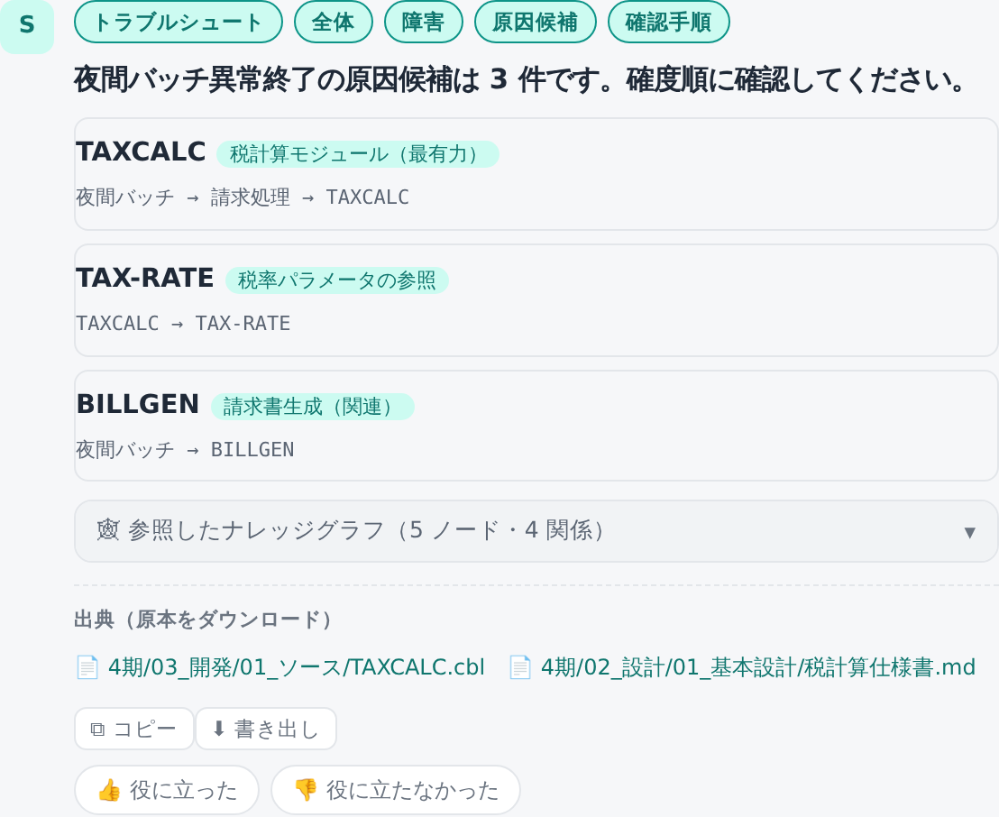
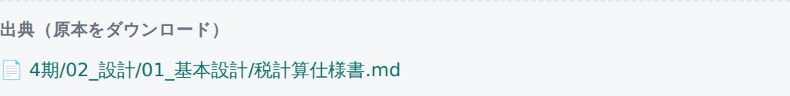
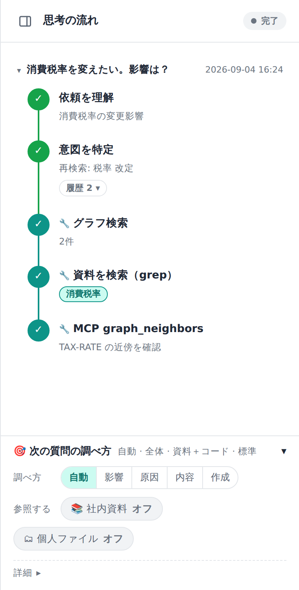
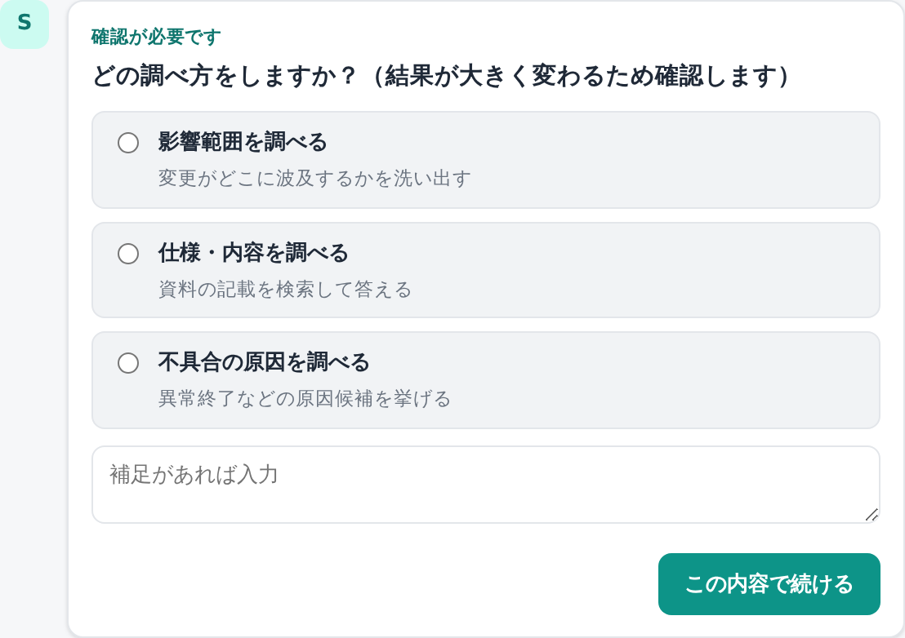

# 10. 使い方：チャットで調べる

入口は**チャット**です。依頼内容を日本語で書けば、システムがやりたいことを選び、**根拠つき**で答えます。

認証が有効な環境では、先にログインします。ログイン後の会話履歴・共有・個人ファイルは自分のユーザーに紐付きます。

画面は3ペイン構成です。

- **左**: 会話一覧（新規・ピン留め・リネーム）。
- **中央**: 会話本体。答えは**答えカード**（結論が先頭）＋**出典フッター**で返ります。
- **右**: 「思考の流れ」。AI が検索・精読・グラフ近傍をどう辿ったかが流れます。

会話一覧では、自分の会話と共有された会話が分かれて表示されます。共有された会話は読み取り専用です。

## 影響範囲分析を依頼する

> 例：「**消費税率を変えると何に影響する？**」

結論カードが先頭に出ます。「『消費税率』を変えると N件に影響。」のように件数が示され、対象が一覧で並びます（区分による優劣はなく同格です）。

- **経路**（なぜ影響するか）を開くと、起点からの依存の鎖（例: 消費税率 ← 税計算ルール ← 見積機能）が辿れます。
- 1件を深掘りして「なぜ？」と聞くと、根拠（設計書の該当記述など）と**原本DL**が返ります。
- 不要な候補は会話で「税抜のみなので非該当」と外せます。
- 構造的な依存が1件も見つからないときは、0件と突き放さず、資料から辿れる関連候補を「**推定**」として別枠で示します（コードの少ない/無いフォルダのサイン）。
- 重要度の高い文書に関わる対象ほど一覧の上に来ます（→ [23. 文書の重要度](23-管理-文書の重要度.md)）。

## トラブルシュートを依頼する

> 例：「**夜間バッチが異常終了した。原因は？**」

確度順に**原因候補カード**が並びます。各候補に「なぜ（関連部品・経路／類似障害）」「確認手順（運用手順より）」「出典」が付きます。

原因候補は、関連部品のつながり（呼び出し・コピー・参照など）をグラフでたどって組み立てられます。

## 仕様を問い合わせる

> 例：「**請求額はどう算出している？**」

該当箇所の抜粋＋出典（仕様書へのリンク）が返ります。**根拠が見つからなければ「該当見つからず」と正直に**返します（推測で埋めません）。

## 出典＝原本ダウンロード

社内資料参照オンで根拠がある回答には、末尾に**出典**が付きます。📄 のリンクをクリックすると、**MD 化した写しではなく原本**（Office なら元の Excel/Word/PowerPoint、ソースなら原文）がダウンロードされます。根拠が無いときは出典は付かず「確証なし」と明示されます。

> 根拠のない断定はしません。出典ゼロのときは「確証なし」と明示します。

## 画像の中の文字も探せます

資料に貼り込まれた画面キャプチャや図の中の文字も、検索の対象です。Word や Excel に貼った画像でも、
画像ファイル単体でも探せます。出典は**その画像を貼った資料**（元の Word/Excel）になります。

ただし読み取りには誤りが混じります。特に英数字の識別子は取り違えが起きやすく、`Office` が
`0ffice` になるようなことがあります。**画像から読んだ文字は、そのまま鵜呑みにせず原本で確かめてください。**
出典から原本をダウンロードできます。

**縦書き**（スキャンした冊子など）は、小さい文字が落ちることがあります。実測では「使って」が「使て」、
「ケープタウン」が「ケプタウン」のように、促音・長音・読点が抜けました。うまく見つからないときは、
確実に読めている部分（漢字の語）で探し直すと当たります（例:「ケープタウン」より「菜園」）。

## 思考の流れを見る

右ペインに、AI が「まず grep で当たりを付け → 関係箇所を精読 → 外れたら検索語を変える → 必要ならグラフ近傍を引く」と調べる過程が流れます。何を根拠にした答えかが透けて見えます。

## 会話を共有する

自分の会話は、**共有**ボタンから他ユーザーへ共有できます。

- 招待するユーザー名を入力します。
- 有効期限を選びます。
- 発行された共有リンクは一度だけ表示されます。
- 招待されたユーザーがログインしてリンクを開くと、読み取り専用の会話として追加されます。

個人ファイルを参照した会話は、そのままでは共有できません。共有ボタンが無効になり、API でも拒否されます。

詳しくは [12. ログイン・共有・個人ファイル](12-使い方-ログイン共有個人ファイル.md)。

## 確認を求められたら

調べる範囲や狙いが曖昧で、確認しないと結果が大きく変わる場合だけ、**確認カード**（選択肢）が出ます。選ぶとその条件で調査が続きます。

## 困ったとき

**回答が資料に基づいていない**

- 「社内資料」がオンか確認します。
- 資料フォルダと範囲が正しいか確認します（範囲を絞りすぎていないか）。
- 資料がまだ取り込み中でないか、管理者に取り込み状況を確認してもらいます。

**出典が出ない**

- 根拠が見つからなかった可能性があります。範囲を広げて再質問します。
- 質問に対象名（画面名・帳票名・ジョブ名など）を足すと見つかりやすくなります。

---

次は、検索の**範囲**や使う **AI** を切り替える方法 → [11. 範囲とAIの切り替え](11-使い方-範囲とAI.md)。
