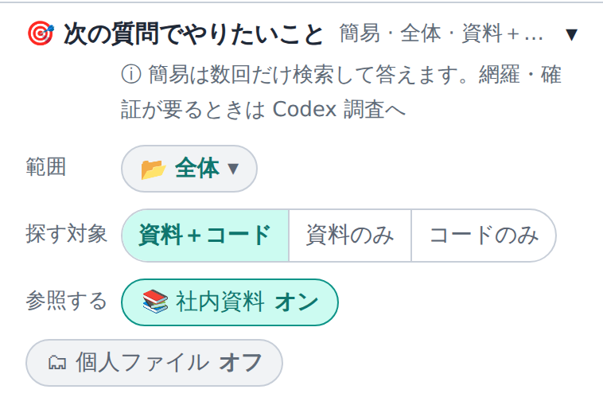
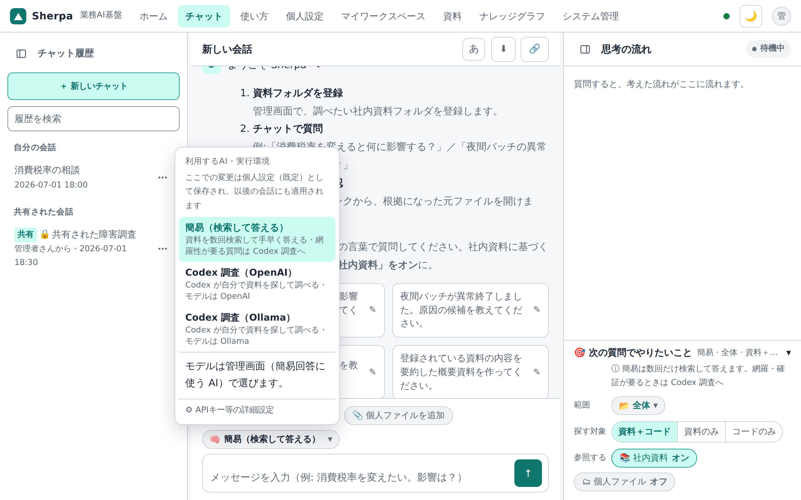

# 11. 使い方：範囲とAIの切り替え

チャットでは「**社内資料を参照するか**」「**どの範囲を見るか**」「**どの AI で考えるか**」を切り替えられます。

## 社内資料の参照

入力欄の近くに「**社内資料**」のオン／オフがあります。**既定はオン**で、頭脳が「Codex 調査」でも「簡易」でも、社内資料を調べて出典つきで答えます。やりたいこと（影響/原因/内容/作成）・出典・範囲の指定もオンのときに使えます。

**オフ**にすると、社内資料も個人ファイルも調べず、一般的な知識だけで答えます（出典は付きません）。頭脳が「Codex 調査」でも、オフのときは「簡易」と同じ AI（管理者が「外部からの簡易回答に使う AI」で選んだもの）が答え、回答の先頭に「社内資料は参照していません」と表示されます。前の会話の内容は引き続き踏まえます。

## 個人ファイル参照のオン／オフ

マイワークスペースにファイルを置いている場合は、**個人ファイル参照**トグルをオンにできます（既定オフ）。

| 状態 | 動き |
|------|------|
| **オフ**（既定） | 社内資料だけを使う。個人ファイルは見ない。 |
| **オン** | 自分の個人ファイルも grep し、回答に「個人ファイル内ヒット」として追加する。 |

個人ファイルは本人の workspace だけが対象です。共有 KB の Elasticsearch / Neo4j には入りません。個人ファイルを参照した会話は通常共有できません。

## 範囲（取込ディレクトリ・フォルダ）

社内資料参照オンのとき、**範囲**を選べます。

- **取込ディレクトリ**: 調べる対象の資料フォルダ（登録フォルダ）。登録が1つだけならセレクタは隠れます。
- **フォルダ範囲（scope）**: その中の特定フォルダに絞り込み（例: 「設計」だけ・「保守」だけ）。フォルダ木がそのまま範囲になります。

範囲を絞ると、検索・影響分析・出典が**その範囲内だけ**に限定されます（範囲外の資料は引用元に出ません）。フォルダ範囲は**選んだフォルダ（prefix）一致**で効きます。共通部品（標準コピーブック等）も対象に含めたいときは、その範囲も合わせて選びます。

## 頭脳（AI）の切り替え

「**頭脳**」で、回答の作り方を選べます。選べるのは「Codex 調査」と「簡易」の2つです。現在の選択がバッジで示されます。

| 頭脳（画面の表示） | 特徴 |
|------|------|
| **Codex 調査（OpenAI）** | 標準。OpenAI Codex CLI が資料とソースを自分で探して調べ、調べる過程が見えます。網羅性・確証が要る質問や、資料（ファイル）の作成に向きます。 |
| **Codex 調査（Ollama）** | 同じ調べ方で、モデルだけ社内のローカル AI（Ollama）を使います。外部に出さない構成向けで、応答品質はモデル次第です。 |
| **簡易（検索して答える）** | 資料を数回だけ検索して手早く答えます。速く答えが欲しい質問向きで、網羅性が要る質問や資料の作成は Codex 調査で行います。 |

- **簡易を選んだとき**: 「調べ方」「調べる深さ」「検索経路」「Web 検索」の行は隠れ、「簡易は数回だけ検索して答えます。網羅・確証が要るときは Codex 調査へ」という案内が出ます。簡易が使う AI は管理者が決めます（個人設定には選択欄がありません。管理者の「簡易回答に使う AI」で、他のアプリから呼び出す簡易回答と共通です）。
- **以前の選択が残っているとき**: 以前に「OpenAI」「ローカル（Ollama）」の直結を選んでいた場合は、そのまま「簡易」として動きます。「AI を使わない簡易」「Gemini」「AWS Bedrock」を選んでいた場合は、別の AI に勝手に切り替わらず、「簡易または Codex 調査を選び直してください」と案内して止まります。
- **使えない環境**: Codex 調査の準備ができていない環境（Codex CLI が無い・認証が無いなど）では「未接続」と案内します。選んである頭脳から、黙って簡易には切り替わりません（頭脳を一度も選んでいない場合に限り、Codex が使えない環境では最初から「簡易」が選ばれています）。

AI の**キーは管理者が設定します**（管理者が許可した場合だけ、設定画面で自分のキーも登録できます）。モデル名は個人設定にはなく、管理者が「使えるモデル」一覧から用意したものを使います。

> セキュリティ: 外部 AI（OpenAI）へは**本文テキスト**を送り（Codex 調査では資料の画像も回答づくりの入力として送ります）、**ファイルは外部に永続化しません**。個人ファイルは共有索引に入れず、本人の検索・回答補助だけに使います。

**ナレッジグラフ（影響分析）は AI を使わず、資料の構造をそのまま解析して作られます**。取り込み時に任意で使える AI（検索用文書の読みやすい整形など）は、チャットの頭脳とは別に管理者が管理します（個人設定に選択欄はありません）。

---

ログイン・共有・個人ファイルは → [12. ログイン・共有・個人ファイル](12-使い方-ログイン共有個人ファイル.md)。
