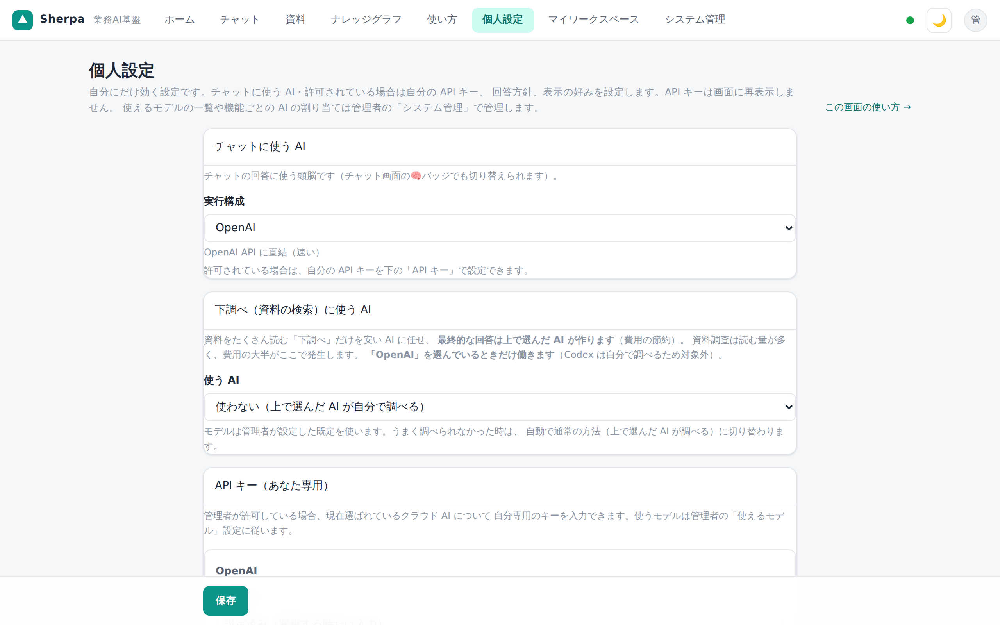

# 13. 個人設定（AIと表示）

「**個人設定**」画面（`settings.html`）は、**自分にだけ効く設定**です。チャットに使う AI（頭脳）、
自分の API キー（Bedrock だけはモデルも）、チャットの回答方針、表示（テーマ）とパスワードをここで
設定します。

全ユーザーに効く設定（資料の読み取り方・旧形式変換・視覚読み取りの AI）は、管理者が
「[24. システム管理](24-システム管理.md)」で行います。個人設定にはその設定項目はありません。

## チャットに使う AI（頭脳）

「**チャットに使う AI**」で、回答を作る AI を選びます。選択肢は次の6つです。

| 頭脳 | 特徴 |
|------|------|
| **簡易（AIなし・最速）**（`heuristic`） | 外部接続なしのテンプレート応答。キー不要ですぐ使えます。自然文の要約力はありません。 |
| **Codex** | OpenAI Codex CLI をエージェントとして動かし、自分で grep して調べます。調べる過程が右ペインに見えます。API キーは不要（別途 `codex login` の認証が要ります）。 |
| **OpenAI** | 外部 API。高品質。本文テキストのみ送信します（ファイルは送りません）。 |
| **Gemini（Google）** | 外部 API。OpenAI と同様、本文テキストのみ送信します。 |
| **AWS Bedrock (Claude)** | AWS Bedrock 上の Claude モデル。本文テキストのみ送信します。 |
| **ローカル（Ollama）** | 手元のパソコン（またはローカルネットワーク）で動く LLM。外部に一切送信しません。応答品質はモデル次第です。 |

ここで選んだ頭脳は、**チャット画面の🧠バッジ**からもワンタップで切り替えられます（同じ設定です）。
各頭脳の向き不向きの目安は「[11. 範囲とAIの切り替え](11-使い方-範囲とAI.md)」の「頭脳（AI）の切り替え」も参照してください。
迷ったら、キー登録なしで試せる「簡易」か、社内資料に対して自分で grep しながら調べる「Codex」から始めるのがおすすめです。

## 下調べ（資料の検索）に使う AI

「チャットに使う AI」で **OpenAI** を選んでいるときだけ、資料をたくさん読む「下調べ」の部分だけを
別の（多くは安い・またはこのパソコンのローカルの）AI に任せられます。最終回答は必ず上で選んだ AI が
作るため、回答の品質を保ったままクラウドの利用量を抑えられます。根拠が十分集まらなかったときは、
自動で従来どおりの方法（上で選んだ AI が自分で調べる）に切り替わります。

- **使う AI**: 「使わない（上で選んだ AI が自分で調べる）」「ローカル（Ollama）」「OpenAI の
  低コストモデル」のいずれかを選びます。モデル名は管理者が「[24. システム管理](24-システム管理.md)」
  で設定した既定を使います。

## 検索用文書の整形に使う AI（任意）

**ナレッジグラフ（影響分析）は AI を使わず、資料の構造だけから作られます**（AI への接続が無くても
影響調査は動きます）。これとは別に、取り込んだ資料を **AI に検索用に読みやすく自動整形させる任意の
オプション**があります（既定 OFF・利用料が発生するため管理者の判断で有効化）。

有効にした場合に使う AI は、**チャットの頭脳とは独立に、管理者が「[24. システム管理](24-システム管理.md)」
で設定します**（管理者がクラウド AI を選んでいればそれを使い、**クラウド AI を一度も選んでいない**ときだけ
ローカル（Ollama）を使います）。個人設定に選択欄はありません。
管理者が選んだクラウド AI に接続できない（キー未設定・残高切れ・API 障害等）ときは、整形はその
まま失敗します（検索・チャットは整形前の内容で通常どおり動きます）——他の AI へ黙って切り替わる
ことはないため、整形を使いたい場合は管理者に接続先・キーの確認を依頼してください。

## API キー（チャットと整形で共用）

登録した API キー・接続先は、上の「チャットに使う AI」からも、管理者が設定した「検索用文書の整形に使う AI」
からも共通で使われます（同じキー・同じ接続先を見ます）。モデル名は OpenAI・Gemini・Ollama・Codex は
管理者が「[24. システム管理](24-システム管理.md)」の「使えるモデル」で管理します。個人設定に選択欄は
ありません（唯一の例外は AWS Bedrock。下記参照）。
**キーは保存すると画面には再表示されません**（入力欄は「設定済み（変更する時だけ入力）」というプレースホルダになります）。
変更したいときだけ新しい値を入力してください。空のまま保存すれば、今の設定は変わりません。

**クラウド AI（OpenAI・Gemini・AWS Bedrock）は管理者が「システム管理」画面で選んだ1つだけが使えます。**
選んでいないクラウド AI は、ここでキーを入力しても実際には使われません（保存はできても実行時は無視されます）。
また、管理者が「利用者ごとの個人キーを許可する」を有効にしていない場合（既定）は、そもそもこの画面に
クラウド AI のキー入力欄が表示されません（「キーは管理者が設定します」という案内が代わりに表示されます）。
管理者がこの許可を OFF にすると、それまでに保存していた個人キーは削除されます（OFF を ON に戻しても
以前のキーは復元されません・再入力が必要です）。ローカル AI（Ollama）の接続先はこの制限の対象外で、
常に個人設定のとおり使えます。

### OpenAI

- **API キー**（`sk-...`）を入力します。**モデル**は個人設定にありません（管理者が
  「[24. システム管理](24-システム管理.md)」の「使えるモデル」で選びます）。
- 本文テキストのみを送信します（ファイルは送りません）。

### Gemini（Google）

- **API キー**（`AIza...`）を入力します。**モデル**は個人設定にありません（管理者が
  「[24. システム管理](24-システム管理.md)」の「使えるモデル」で選びます）。
- キーは [Google AI Studio](https://aistudio.google.com/apikey) で取得します。
- 本文テキストのみ送信します。

### AWS Bedrock (Claude)

- **Bedrock API キー**: Bedrock コンソール（Playground）で発行した API キー（Bearer・長期／短期どちらも可）を入力します。
  未入力のときは管理者の中央設定（システム管理画面）のキー、それも無ければサーバの AWS 認証情報（SigV4・
  インフラ側の設定）を使います。
- **モデル**: リージョンは東京固定、モデルは推論プロファイル経由で選びます。モデルを増やす方法は2つです。
  - **「利用可能なモデルを取得」**: 保存済みのキーで、そのアカウントが実際に使えるモデルの一覧を取得します
    （未保存の入力中のキーは対象外です。先に保存してから使ってください。取得には接続テストとは別の AWS 権限が必要な場合があります）。
  - **「モデルIDを直接追加」**: 一覧取得がうまくいかない場合に、分かっているモデル ID を入力して「検証して追加」を押すと、
    保存済みのキーで実際に1回だけ呼び出して確認したうえで選択肢に追加します（推測での追加はしません）。
- 本文テキストのみ送信します。

### ローカル LLM（Ollama）

- **接続先**は、管理者が許可した一覧から選びます（「管理者の既定を使う」のままなら管理者の既定接続先が
  使われます）。管理者が許可していない接続先は選べません。**モデル**は個人設定にありません（管理者が
  「[24. システム管理](24-システム管理.md)」の「使えるモデル」で選びます）。
- 無料・無制限（手元のパソコンで実行）。事前に `ollama serve` の起動とモデル取得（例 `ollama pull qwen2.5`）が必要です。

### Codex（チャット専用）

- **モデル**と**思考の深さ**は個人設定にありません。モデルは管理者が
  「[24. システム管理](24-システム管理.md)」の「使えるモデル」で選び、思考の深さは環境設定の既定
  （通常は `low`）に従います。
- API キーは不要です（別途 CLI 側で `codex login` によるログインが必要です）。
- **検索用文書の整形には使えません**（チャット専用）。
- **Web 検索**は個人設定にありません。管理者が「[24. システム管理](24-システム管理.md)」の
  「プロバイダ＋接続先」タブで許可し、かつ頭脳が Codex（OpenAI 直結）のときだけ、チャット画面の
  調べ方ブロック（「参照する」行）に「**Web 検索**」チェックボックスが表示されます（既定は
  非表示＝社内資料のみを参照）。オンにすると、社内資料に加えて Web も参照します。同じ会話では
  次の質問や会話を開き直したときにも直近の設定を引き継ぎます（毎回オンにし直す必要はありません）。
  新しい会話を始めると、常にオフから始まります。Codex（Ollama）では、管理者が許可していても
  Web 検索は使えません（OpenAI がホストする検索機能のため）。

### 接続テスト

各 API キーの入力欄の下にある「**接続テスト**」ボタンで、入力中のキーのまま実際に1回だけ疎通を試せます
（保存はしません）。モデルは管理者の「使えるモデル」の設定値を使います（Bedrock だけはモデル欄も
入力中の値のまま試せます）。結果は「✓ 接続OK」または「✗ 失敗理由」で表示されます。

## 外部連携（自分の API キー）

管理者が「利用者のキー発行を許可する」を有効にしている場合だけ、この欄が表示されます（既定は無効）。
他のアプリからこの Sherpa の検索・変換を、自分専用のキーで呼び出せます（アクセスできる範囲は自分の
権限内に限られます）。

- **発行**: ラベル（用途のメモ）・有効期限（任意）・1日あたりの呼び出し上限（任意・空欄は管理者の既定を
  適用）・Webhook URL（任意・取り込み完了/失敗の通知先。管理者が許可した宛先のみ指定できます）を
  入力して発行します。**キー本体は発行直後の1回だけ画面に表示されます**（Webhook を指定した場合は
  署名検証用のシークレットも同じく1回だけ表示されます・以後は再表示できません・必ずその場で控えを
  保管してください）。Webhook 通知の仕組みは「[24. システム管理](24-システム管理.md)」の
  「外部連携（API キー）」節を参照してください。
- **紛失時**: 表示し忘れた・控え忘れた場合は、そのキーを失効させて新しく発行し直してください
  （同じキーを再表示する手段はありません）。
- **失効**: 一覧の「失効」ボタンでいつでも無効化できます（元に戻せません）。
- 管理者が「利用者のキー発行を許可する」を無効に戻すと、利用者が発行したキーは**すべて自動的に失効**します。

## チャットの回答方針（システムプロンプト）

チャットの AI に与える追加の回答方針を自由記述で設定できます。空にすると追加の方針なし（モデル既定のまま）で動きます。
「**既定に戻す**」を押すと、次の既定文が入ります。

> 憶測で回答しないでください。不明な点は不明と伝えてください。根拠のある情報と推測を明確に分けてください。
> 事実確認が必要な内容については、確認できた情報をもとに回答してください。回答では、結論・理由・補足を分かりやすく整理してください。

## 表示・パスワード

- **テーマ（明るさ）**: 画面右上のボタンで明るい／暗いを切り替えます。設定はこの端末のブラウザに保存されます
  （他の端末やユーザーには影響しません）。
- **パスワード変更**: 画面右上のユーザーメニューから「パスワード変更」を開きます。新しいパスワードは
  8 文字以上の半角英数字・記号のみです（全角文字・空白は使えません）。

## 保存のしかた

画面下部に固定された「**保存**」ボタンを押すと、変更した項目だけがまとめて反映されます。
`Ctrl+S`（Mac は `Cmd+S`）でも保存できます。

---

全ユーザーに効く設定（取り込み方・旧形式変換・視覚読み取りの AI・管理メニュー）は → [24. システム管理](24-システム管理.md)。
