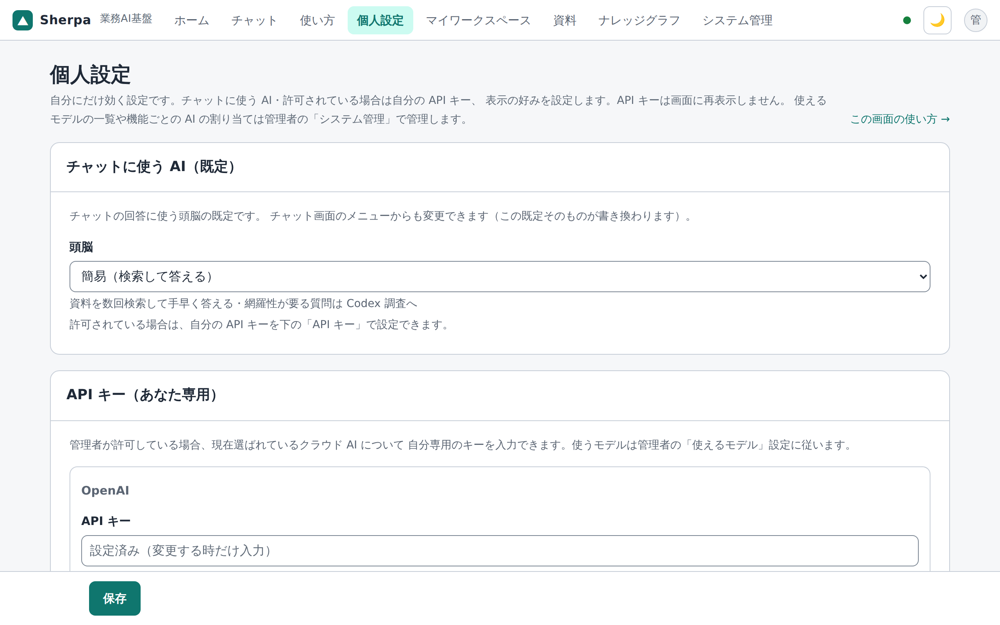

# 13. 個人設定（AIと表示）

「**個人設定**」画面（`settings.html`）は、**自分にだけ効く設定**です。チャットに使う AI（頭脳）、
（許可されている場合は）自分の API キー、ローカル AI（Ollama）の接続先、表示（テーマ）とパスワードをここで
設定します。

全ユーザーに効く設定（資料の読み取り方・旧形式変換・視覚読み取りの AI）は、管理者が
「[24. システム管理](24-システム管理.md)」で行います。個人設定にはその設定項目はありません。

項目単位の一覧（何をする設定か・既定値・変えるとどうなるか）は「[25. 設定リファレンス](25-設定リファレンス.md)」に
まとめています。

## チャットに使う AI（頭脳）

「**チャットに使う AI**」で、回答の作り方を選びます。選択肢は次の3つです。

| 頭脳（画面の表示） | 特徴 |
|------|------|
| **Codex 調査（OpenAI）** | 標準。OpenAI Codex CLI をエージェントとして動かし、自分で資料とソースを探して調べます。調べる過程が右ペインに見えます。資料（ファイル）の作成もできます。資料の画像を開いて読むことがあり、その画像も回答づくりの入力として送られます（ファイルとして外部に残りはしません）。API キーは不要です（別途 `codex login` の認証が要ります）。 |
| **Codex 調査（Ollama）** | 同じ調べ方で、モデルだけ手元のパソコン（またはローカルネットワーク）の Ollama を使います。資料は外部に出ません。応答品質はモデル次第です。 |
| **簡易（検索して答える）** | 資料を数回だけ検索して手早く答えます。使う AI は管理者が決めます（下の「簡易が使う AI」）。網羅性・確証が要る質問や資料の作成は Codex 調査で行います。 |

ここで選んだ頭脳は、**チャット画面の🧠バッジ**からもワンタップで切り替えられます（同じ設定です）。
各頭脳の向き不向きの目安は「[11. 範囲とAIの切り替え](11-使い方-範囲とAI.md)」の「頭脳（AI）の切り替え」も参照してください。
迷ったら、社内資料に対して自分で調べる「Codex 調査」から始め、速く答えが欲しいときだけ「簡易」を使うのがおすすめです。

- **以前の選択が残っているとき**: 以前に「OpenAI」「ローカル（Ollama）」の直結を選んでいた場合は、そのまま「簡易」として扱われます（保存されている内容は書き換えません）。「AI を使わない簡易」「Gemini」「AWS Bedrock」を選んでいた場合は、別の AI に勝手に切り替わらず、チャットで「簡易または Codex 調査を選び直してください」と案内して止まります。この画面で選び直して保存してください。
- **簡易が使う AI**: 管理者が「[24. システム管理](24-システム管理.md)」の「外部連携」タブの「簡易回答に使う AI」で、OpenAI かローカル（Ollama）のどちらかに決めます。他のアプリが呼び出す簡易回答（外部連携）と共通で、個人設定には選択欄がありません。簡易は管理者が設定したキー・接続先だけを使い、個人のキーや個人の Ollama 接続先は使いません。
- **簡易では隠れる行**: 簡易を選ぶと、チャット画面の「調べ方」「調べる深さ」「検索経路」「Web 検索」の行は隠れます（簡易では効かないため）。

## 個人設定にないもの

次の項目は、以前は個人で設定できましたが、現在は**ありません**。

- **回答方針（システムプロンプト）**: 回答の方針はアプリで固定です。利用者ごとに書き換える欄はありません。
- **下調べに使う AI**: 選択欄はありません。Codex 調査では、下調べ役のモデルを管理者が決めます。
- **モデル名・Codex の思考の深さ**: 管理者の「使えるモデル」と、環境設定の既定に従います。

## 検索用文書の整形に使う AI（任意）

**ナレッジグラフ（影響分析）は AI を使わず、資料の構造だけから作られます**（AI への接続が無くても
影響調査は動きます）。これとは別に、取り込んだ資料を **AI に検索用に読みやすく自動整形させる任意の
オプション**があります（既定 OFF・利用料が発生するため管理者の判断で有効化）。

有効にした場合に使う AI は、**チャットの頭脳とは独立に、管理者が「[24. システム管理](24-システム管理.md)」
で設定します**（管理者がクラウド AI を選んでいればそれを使い、**クラウド AI を一度も選んでいない**ときだけ
ローカル（Ollama）を使います）。個人設定に選択欄はありません。
管理者が選んだクラウド AI に接続できない（キー未設定・残高切れ・API 障害等）ときは、整形はその
まま失敗します（検索・チャットは整形前の内容で通常どおり動きます）——他の AI へ黙って切り替わる
ことはないため、整形を使いたい場合は管理者に接続先・キーの確認を依頼してください。

## API キー（チャットと整形で共用）

登録した API キー・接続先は、上の「Codex 調査」（接続先が Azure OpenAI など OpenAI 以外のとき）からも、管理者が設定した
「検索用文書の整形に使う AI」からも共通で使われます（同じキー・同じ接続先を見ます）。簡易は管理者の中央設定だけを使います。モデル名は OpenAI・Ollama・Codex は
管理者が「[24. システム管理](24-システム管理.md)」の「使えるモデル」で管理します。個人設定に選択欄は
ありません。
**キーは保存すると画面には再表示されません**（入力欄は「設定済み（変更する時だけ入力）」というプレースホルダになります）。
変更したいときだけ新しい値を入力してください。空のまま保存すれば、今の設定は変わりません。

**クラウド AI（OpenAI）は管理者が「システム管理」画面で設定した接続先で使われます。**
また、管理者が「利用者ごとの個人キーを許可する」を有効にしていない場合（既定）は、そもそもこの画面に
クラウド AI のキー入力欄が表示されません（「キーは管理者が設定します」という案内が代わりに表示されます）。
管理者がこの許可を OFF にすると、それまでに保存していた個人キーは削除されます（OFF を ON に戻しても
以前のキーは復元されません・再入力が必要です）。ローカル AI（Ollama）の接続先はこの制限の対象外で、
常に個人設定のとおり使えます。

### OpenAI

- **API キー**（`sk-...`）を入力します。**モデル**は個人設定にありません（管理者が
  「[24. システム管理](24-システム管理.md)」の「使えるモデル」で選びます）。
- 本文テキストのみを送信します（ファイルは送りません）。

### ローカル LLM（Ollama）

「Codex 調査（Ollama）」が使う接続先です（簡易は使いません）。

- **接続先**は、管理者が許可した一覧から選びます（「管理者の既定を使う」のままなら管理者の既定接続先が
  使われます）。管理者が許可していない接続先は選べません。**モデル**は個人設定にありません（管理者が
  「[24. システム管理](24-システム管理.md)」の「使えるモデル」で選びます）。
- 無料・無制限（手元のパソコンで実行）。事前に `ollama serve` の起動とモデル取得（例 `ollama pull qwen2.5`）が必要です。

### Codex 調査（チャット専用）

- **モデル**と**思考の深さ**は個人設定にありません。モデルは管理者が
  「[24. システム管理](24-システム管理.md)」の「使えるモデル」で選び、思考の深さは管理者が
  「システム管理」の「調査・回答」タブで決めた基準値に従います（未設定のときの既定は `medium`。
  調べる深さが「クイック」のときは 1 段下がります）。
- API キーは不要です（別途 CLI 側で `codex login` によるログインが必要です）。
- **検索用文書の整形には使えません**（チャット専用）。
- **Web 検索**は個人設定にありません。管理者が「[24. システム管理](24-システム管理.md)」の
  「プロバイダ＋接続先」タブで許可し、かつ頭脳が「Codex 調査（OpenAI）」のときだけ、チャット画面の
  やりたいことブロック（「参照する」行）に「**Web 検索**」チェックボックスが表示されます（既定は
  非表示＝社内資料のみを参照）。オンにすると、社内資料に加えて Web も参照します。同じ会話では
  次の質問や会話を開き直したときにも直近の設定を引き継ぎます（毎回オンにし直す必要はありません）。
  新しい会話を始めると、常にオフから始まります。「Codex 調査（Ollama）」では、管理者が許可していても
  Web 検索は使えません（OpenAI がホストする検索機能のため）。

### 接続テスト

各 API キーの入力欄の下にある「**接続テスト**」ボタンで、入力中のキーのまま実際に1回だけ疎通を試せます
（保存はしません）。モデルは管理者の「使えるモデル」の設定値を使います。結果は「✓ 接続OK」または「✗ 失敗理由」で表示されます。

## 外部連携（自分の API キー）

管理者が「利用者のキー発行を許可する」を有効にしている場合だけ、この欄が表示されます（既定は無効）。
他のアプリからこの Sherpa の検索・変換を、自分専用のキーで呼び出せます（アクセスできる範囲は自分の
権限内に限られます）。

- **発行**: ラベル（用途のメモ）・有効期限（任意）・1日あたりの呼び出し上限（任意・空欄は管理者の既定を
  適用）・Webhook URL（任意・取り込み完了/失敗の通知先。管理者が許可した宛先のみ指定できます）を
  入力して発行します。**キー本体は発行直後の1回だけ画面に表示されます**（Webhook を指定した場合は
  署名検証用のシークレットも同じく1回だけ表示されます・以後は再表示できません・必ずその場で控えを
  保管してください）。Webhook 通知の仕組みは「[24. システム管理](24-システム管理.md)」の
  「外部連携（API キー）」節を参照してください。
- **紛失時**: 表示し忘れた・控え忘れた場合は、そのキーを失効させて新しく発行し直してください
  （同じキーを再表示する手段はありません）。
- **失効**: 一覧の「失効」ボタンでいつでも無効化できます（元に戻せません）。
- 管理者が「利用者のキー発行を許可する」を無効に戻すと、利用者が発行したキーは**すべて自動的に失効**します。

## 表示・パスワード

- **テーマ（明るさ）**: 画面右上のボタンで明るい／暗いを切り替えます。設定はこの端末のブラウザに保存されます
  （他の端末やユーザーには影響しません）。
- **パスワード変更**: 画面右上のユーザーメニューから「パスワード変更」を開きます。新しいパスワードは
  8 文字以上の半角英数字・記号のみです（全角文字・空白は使えません）。

## 保存のしかた

画面下部に固定された「**保存**」ボタンを押すと、変更した項目だけがまとめて反映されます。
`Ctrl+S`（Mac は `Cmd+S`）でも保存できます。

---

全ユーザーに効く設定（取り込み方・旧形式変換・視覚読み取りの AI・管理メニュー）は → [24. システム管理](24-システム管理.md)。
