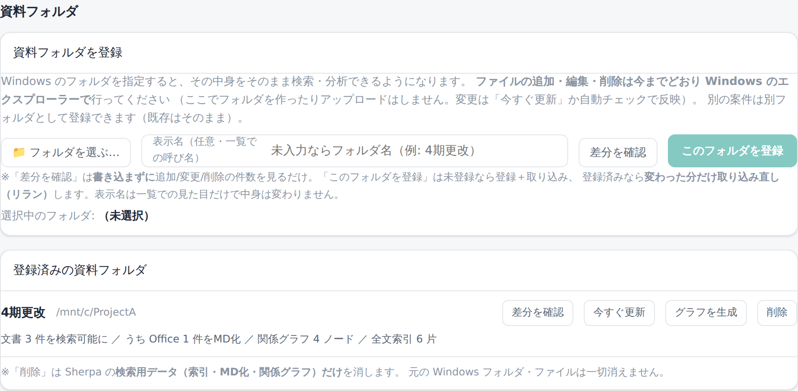

# 20. 管理：資料の取り込み

この画面は管理者向けです。操作には `admin` ロールが必要です。

## 考え方：ディレクトリの鏡

取り込みは「**置いた構造そのままが社内資料になる**」モデルです。

- **登録したフォルダ＝1つの世界**（1グラフ＋1全文索引）。**フォルダ木がそのまま範囲**。
- **置いた構造をそのまま映す**: 更新すれば置き換わり、削除すれば消える。ただし反映は**自動監視ではなく、取り込み（登録／[取り込み開始]／再取り込み、または任意の定期ポーリング）の実行時**に行われます。
- **同一性＝パス**: 同名でも別フォルダなら別物として扱い、取り違えません。
- 登録フォルダは**読み取り専用**（システムは編集・移動・削除をしません）。

つまり、整理されたフォルダを登録すれば、その整理がそのまま検索・影響分析の構造になります。

## 資料フォルダを登録する

「**資料**」画面の上部「資料フォルダ」で、取り込む対象フォルダを登録します（旧「資料を取り込む」画面を統合）。

- **Windows のフォルダ**（例: `C:\test`）を指定できます。内部では WSL のパス（`/mnt/c/test`）として読み取ります。
- 大量データは常時監視せず、**[取り込み開始]を明示**して走らせます。
- 登録すると取り込み（スキャン → 抽出 → グラフ反映 → 全文索引）が実行されます。

### 取り込まれるもの

| 種別 | 扱い |
|------|------|
| 設計書・仕様（`.md` 等） | そのまま本文として索引 |
| ソース（`.cbl`/`.jcl`/`.cpy`） | 原文のまま（MD 化しない）。静的解析で呼び出し・コピー関係をグラフ化 |
| Office（`.xlsx`/`.docx`/`.pptx`） | **決定的に Markdown へ変換**して索引（**原本はそのまま保持**＝出典DLは原本を返す） |
| PDF（文字入り） | **既定で有効**な読み取り方式が文字を抽出して索引します（追加の準備は不要）。文字が少ない・埋め込みフォントで抽出が不十分な PDF は、管理者がシステム管理で「視覚読み取り」を足すと補われます |
| 画像ファイル（`.png`/`.jpg` 等） | 取り込み対象。**既定で画像の中の文字を読み取ります**（下記「画像の中の文字」）。さらに管理者がシステム管理で「視覚読み取り」（AI が画像を見て内容を説明する）を足すこともできます |
| 画像だけの PDF（スキャン） | PDF として取り込み対象になりますが、文字が取れないため既定は**変換失敗**として表示されます。「視覚読み取り」を有効にすると AI が読み取ります |
| 旧形式（`.doc`/`.xls`/`.ppt`） | 既定は未対応。管理者がシステム管理で旧形式の変換（LibreOffice／Office 連携）を選ぶと、新形式に変換してから読み取られます |

> Office の「写し（MD）」は検索のためのもので、**出典をクリックすると原本（元の Excel/Word）**が落ちます。利用者は写しを意識しません。

読み取り方式（アーム）の有効化・旧形式の変換方法の切り替えは管理者向けの設定です。詳しくは「[24. システム管理](24-システム管理.md)」を参照してください。

### 画像の中の文字

資料に貼り込まれた画面キャプチャや図の中の文字も、**既定で読み取って検索できるようにします**。
Word や Excel に貼った画像でも、画像ファイル単体でも同じです。

読み取った文字は「**補助の観測**」として、Office から機械的に取り出した確定値とは**別に**持ちます。
分けているのは、読み取りには必ず誤りが混じるからです。実測では、日本語の文章はほぼ正確に読める一方、
英数字の識別子で `Office` を `0ffice` と読むような取り違えが起きます。確定値と混ぜると、
その誤りが「資料にそう書いてある」ことになってしまいます。

縦書きの資料では、促音「っ」・長音「ー」・読点が落ちることがあります（実測: 「使って」→「使て」）。
横組みは同じ語でも正しく読めるため、縦書き特有の弱点です。

スキャンした大きな紙面は時間がかかります（実測: A4相当・1700×2501 の1ページで約5分）。取り込み自体は
すぐ終わり、読み取りは裏で進みます。

そのため、

- 検索・チャットの材料としては**使う**（画像の中の文字で資料に辿り着ける）
- 出典は**元の資料**（画像を貼った Word/Excel、または画像ファイルそのもの）
- 読み取り結果を**自動で直したりはしない**（原文のまま残す）

という扱いです。

止めたい場合は、`.env` に `SHERPA_OCR_ENABLED=0` を設定します。読み取りだけが行われなくなり、
取り込みと検索は通常どおり動きます。準備と運用は「[40. 運用](40-運用.md)」を参照してください。

## 取り込み状況を見る

「**資料**」画面の下部「取り込み状況」で、何が取り込まれたか・状態・範囲を確認します。

- **検索＋状態フィルタ**が主導線。各文書の状態（使えます／MD化）が分かります（PDF・旧バイナリ等の**未対応は一覧には載らず、件数で**表示）。
- **フォルダツリー**（範囲）を副導線として併設。クリックでその範囲に一覧を絞れます。
- 各文書は**原本DL**できます。物理パスは画面に出しません。
- うまくいかない時は**やり直す**（再取り込み）。再取り込みは世界全体のクリーン再構築で、消えたファイルはグラフからも消えます。

### 取り込み中の進み具合

取り込みを実行している間は、上のスクリーンショットの画面に**5段のステッパー**が出ます。

1. **フォルダ確認**（対象フォルダの中身を数える）
2. **読める写し(MD)作成**（Office 文書などを検索できる形に変換する）
3. **関係グラフ**（ソースコードの呼び出し・コピー関係を解析する）
4. **全文索引・ベクトル化**（検索用に本文を登録する）
5. **仕上げ**（後片付け・完了処理）

済んだ段は**✓**付きの薄い文字、いま処理中の段は**▶**（読み込み中マーク）と件数（分かっていれば「N/全体件数」、走査中でまだ全体数が分からないときは「N件確認済み」）で表示され、まだの段は薄い色のまま残ります。削除など上記以外の操作中は、この5段ステッパーではなく従来どおり処理内容が1行で表示されます。

### 困ったとき

- 文書が出ない場合は、登録したフォルダパスと（サーバーから見た）読み取り権限を確認します。
- Office 文書の内容が出ない場合は、変換状態（MD化）を確認します。
- 不要な資料が出る場合は、元フォルダから外して再取り込みします。
- 更新したのに反映されない場合は、再取り込みを実行したか、取り込みが失敗していないかを確認します。

## 参照先を変える・削除する

- **参照先の変更（rebind・API 機能）**: 同じ世界の参照フォルダを別の場所に差し替えます（旧データは破棄して新フォルダから作り直し）。※現在は API（`POST /worlds/{id}/rebind`）として提供。画面の操作ボタンは未提供。
- **削除**: その世界の派生物（グラフ・全文索引・派生MD・台帳）まで一括で消えます。**登録元の外部フォルダ自体は消しません**。

> これらの操作で「消し残し（孤児）」が出ないよう、システムは取り込み・削除・起動の直後に**自動で整合（自己修復）**します。管理者が掃除を意識する必要はありません（[30-しくみ](30-しくみ.md) の「自己修復」）。

---

グラフの確認・全文検索は → [21. グラフと検索](21-管理-グラフと検索.md)。
ユーザー管理と監査ログは → [22. ユーザーと監査](22-管理-ユーザーと監査.md)。
