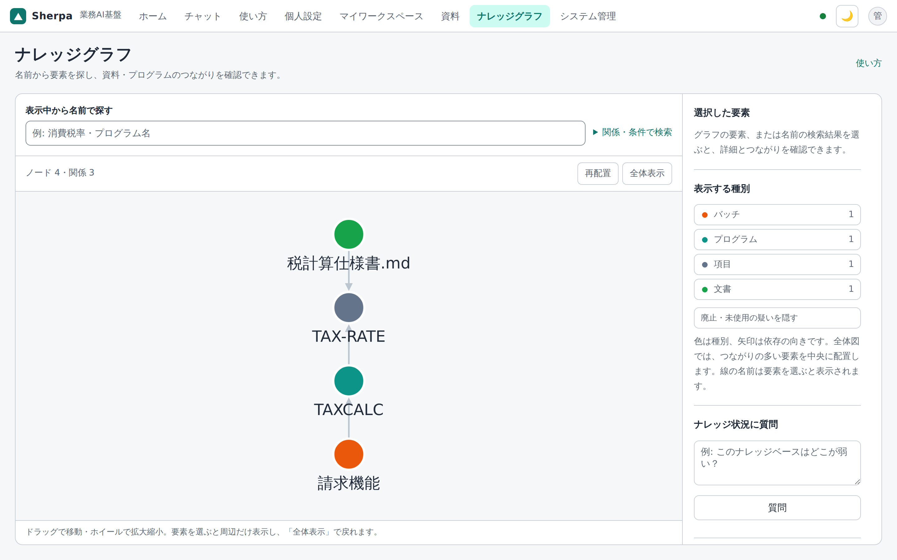
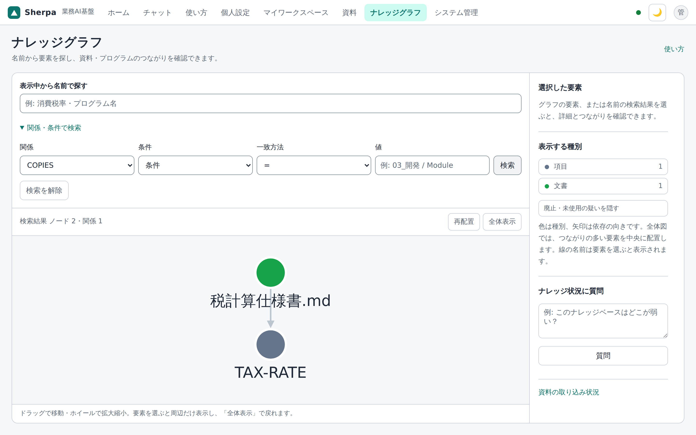
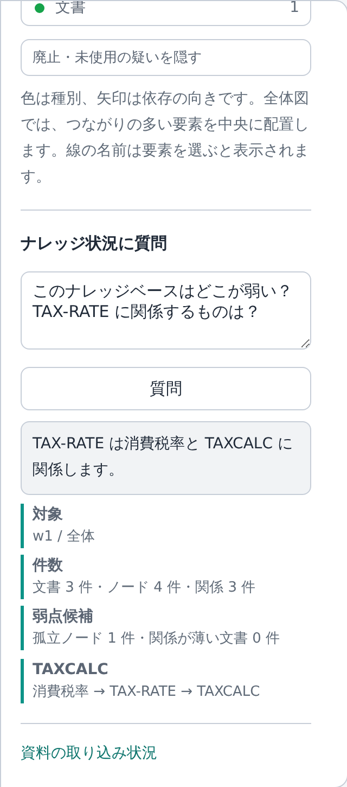
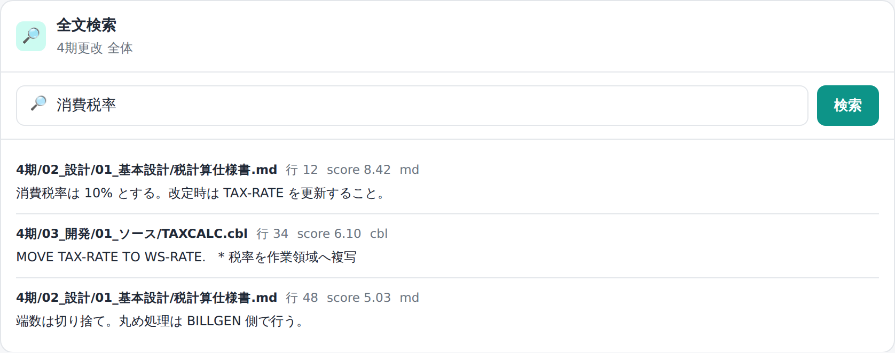

# 21. 管理：グラフと検索

取り込んだ社内資料は、**グラフ**（関係の地図）と**全文検索**で直接確認できます。
管理画面の操作には `admin` ロールが必要です。

## ナレッジグラフ

「**ナレッジグラフ**」画面で、部品（プログラム・コピーブック・データ項目・ジョブ・関連文書など）と関係を可視化します。

- 種別ごとに**色分け**して表示。
- 全体図では、つながりの多い要素を中央に配置します。拡大すると要素名を読めます。
- ノードをクリックすると周辺だけが表示され、右側の**選択した要素**に詳細と接続先の一覧が表示されます。
- **表示中から名前で探す**に入力し、候補を選ぶと周辺だけを表示します。候補が多いときは先頭 50 件を表示するため、名前を追加して絞り込んでください。
- 図や接続先の一覧から、つながりをたどれます。**全体表示**で元の全体図に戻り、**この語で影響を調べる**でチャットに送れます。
- **すべて表示**が出ている間、名前検索の対象は読み込み済みの主要ノードです。押すと全件を読み込みます。

### 関係・条件でのグラフ検索

**関係・条件で検索**を開くと、名前だけでなく、**関係の種類**や**属性条件**で絞り込めます。**検索を解除**で元のグラフに戻ります。

- **関係種別**: 呼び出し（INVOKES）・コピー（COPIES）・格納（CONTAINS）・言及（DOCUMENTS）など、実際の語彙から選びます。
- **条件**: 分類・工程・役割・状態などの属性で絞ります。
- 結果は可視化と同じ形（ノード＋辺）で返り、選んだ世界の範囲に限定されます。

### ナレッジ状況へ自然言語で質問する

グラフ画面の「ナレッジ状況に質問」では、通常チャットとは別に、取り込まれている資料やグラフの状態を**普通の言葉で質問**できます（read-only）。

- 対象 world / scope、文書数、ノード数、関係数、孤立ノード、関係が薄い文書などの集計を根拠として表示します。
- AI が必要に応じてグラフの近傍を辿り、**根拠ノード（経路つき）**を添えて答えます。
- **根拠が見つからないときは断定しません**（「グラフ上に根拠が見つかりませんでした」と返す）。
- AI 接続が無い場合も、取得できる集計にもとづく簡易回答を返します。AI 接続がある場合は OpenAI / Gemini / Ollama を使います。

## 全文検索（ES）

「**取り込み状況**」画面の**全文検索パネル**で、社内資料を日本語全文検索できます。

- 形態素解析（kuromoji）で**分かち書きした語句一致の全文検索**（BM25・関連度順）。表記ゆれ・自然文に強い（言い換えに効くベクトル検索は、埋め込みを有効にした環境でのみ）。
- ヒットは **文書・行・抜粋・スコア**で返り、左のフォルダツリーで選んだ範囲に絞れます。
- 物理パスは出さず、文書名（相対パス）だけを表示します。

---

ユーザー管理と監査ログは → [22. ユーザーと監査](22-管理-ユーザーと監査.md)。
中で何が起きているか（しくみ）は → [30. しくみ](30-しくみ.md)。
