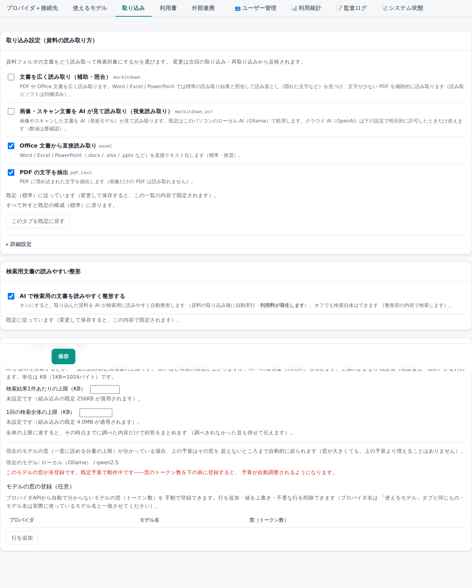

# 24. システム管理

「**システム管理**」画面（`admin-settings.html`）は、**全ユーザーに効く設定**と、管理系画面への入口です。
`admin` ロールが必要です。自分だけの設定（頭脳・自分のAPIキー・回答方針・表示）は
「[13. 個人設定](13-個人設定.md)」で行います。



## 全体設定の考え方

全ユーザーに効く設定は「**全体設定**」として DB に保存されます。優先順は次のとおりです。

**全体設定（system_settings） ＞ 環境変数（env・`.env`） ＞ アプリの既定値**

各項目は、この画面で明示的に変更しない限り env／既定に従います。画面には「**既定に従っています**」
（＝env/既定のまま）か「**この内容で固定中です**」（＝全体設定で明示的に変更済み）かが表示されます。
「**既定に戻す**」を押すと、その項目の全体設定を消して env／既定へ戻します。

変更は保存と**同じトランザクションで監査ログに記録**されます。記録に失敗した場合は保存そのものを取り消します
（**fail-closed**＝「変更されたのに記録が残らない」状態を作りません）。誰が・いつ・何を変更したかは
「[22. ユーザーと監査](22-管理-ユーザーと監査.md)」の監査ログで確認できます。

**例外（AIプロバイダのキー・接続先、埋め込みモデルの既定値）**: 下の「AIプロバイダ（クラウド）」欄と、
「使えるモデル（モデルカタログ）」の OpenAI 埋め込みモデル既定（env `OPENAI_EMBED_MODEL`）は、
env は**初回起動時に一度だけこの画面へ取り込まれ、以後は読まれません**（env を書き換えても
2回目以降の起動には効きません）。一度起動した後は、この画面（管理画面）が唯一の管理場所です。

## AIプロバイダ（クラウド）

クラウドの AI（OpenAI・Gemini・AWS Bedrock）は**同時に1つだけ**選びます。選んでいない側のキーは
消えずに残りますが使われません（後で切り替えたときに再入力しなくて済みます）。ローカル AI（Ollama）は
この排他選択の対象外で、クラウドの選択に関わらずいつでも併用できます。

- **プロバイダの選択**: OpenAI / Gemini / AWS Bedrock から1つを選びます。選んだプロバイダの API キー
  欄だけがこの下に表示されます。
- **接続テスト**: 入力中のキーで1回だけ接続を試せます（保存はしません）。
- **利用者ごとの個人キーを許可する**（既定 OFF）: OFF のときは、この画面の中央キーだけが使われます。
  利用者の「個人設定」画面には API キーの入力欄が出ません（「キーは管理者が設定します」という案内が
  代わりに表示されます）。**OFF で保存すると、既に保存済みの利用者の個人キーはすべて削除されます**
  （OFF の間は個人キーを保存しない、という状態を保つため）。ON にすると、利用者は自分の API キーを
  「個人設定」で入力・優先利用できます（利用者ごとに課金元を分けたい場合など）。個人にはキーを
  発行しない、という既定の運用方針に沿って OFF を推奨します。
- **ローカル AI（Ollama）の接続先**: クラウドの選択に関わらず使える、社内のローカル AI の既定の接続先です。
- **利用者が選べる接続先**（許可ホスト一覧）: 利用者の「個人設定」で選べる Ollama 接続先を、
  1行1つの `host:port` 形式で登録します。自分のパソコンだけで使う場合は空のままで構いません
  （`localhost` は登録の有無に関わらず常に使えます）。ここに登録していない接続先は、利用者が
  個人設定で選ぼうとしても保存できません（誤って社外／無関係なホストへ接続しないための許可制）。

## 使えるモデル（モデルカタログ）

実際に使われるモデル名は、利用者側の自由入力ではなく**ここで登録した一覧（既定）**で決まります
（Bedrock だけは実在確認つきのモデルを利用者本人が選ぶ別の仕組みがあり対象外）。表は縦に「用途」
（チャット・検索用文書の整形など）、横に「プロバイダ」（選択中のクラウド AI・ローカル AI（Ollama）・Codex）を
並べた1枚表で、選んでいないクラウド AI の列は出ません。

- 各セルは「選べるモデル名の一覧」と「既定（実際に使われるモデル）」を持ちます。編集はセル内の
  ボタンから行い、「既定に戻す」で組み込みの一覧・既定へ戻せます。
- 保存できるモデル名には共通の文法（英数字で始まり `. _ : / -` のみ・長さの上限）があります。
  Codex 用の欄はさらに厳しい制約（`:` 不可・短い上限）があります。CLI へそのまま渡す文字列の
  ため、ここで拒否される値は Codex では常に使えません。
- ここで「既定」を変更すると、次回以降すぐにその値が使われます（利用者側に個別の選択欄は
  なく、切り替えの操作は不要です）。

## 取り込み設定（資料の読み取り方）

資料フォルダの文書をどう読み取って検索・グラフの対象にするかを、**アーム（読み取り方式）**単位で選べます。
チェックを変えても既存の取り込み済みデータはすぐには変わらず、**次回の取り込み・再取り込みから反映**されます。

| アーム | 何をするか | 既定 |
|--------|-----------|------|
| Office 文書から直接読み取り（`ooxml`） | Word/Excel/PowerPoint を直接テキスト化します。値の権威（数値や表はここが正）。 | 有効 |
| PDF の文字を抽出（`pdf_text`） | PDF に埋め込まれた文字を抽出します。画像だけの PDF（スキャンした紙資料など）は文字が取れません。 | 有効 |
| 視覚読み取り（`vision`） | 画像・スキャン文書を AI（視覚モデル）が実際に「見て」読み取ります。文字がほぼ無い PDF・スキャン画像に効きます。 | 無効（任意で追加） |

※ 「文書を広く読み取り（`markitdown`）」は廃止しました（2026-08・変換を `ooxml` に一本化）。画像の中の文字は、
上のアームとは別に **OCR（既定で有効・[40-運用](40-運用.md)）**が読み取ります。

読み取りに使うソフト（Office/PDF 抽出用のライブラリ）は最初から同梱されているため、
「Office 文書から直接読み取り」「PDF の文字を抽出」は**追加の準備なしにそのまま動きます**。

**どういう資料でどれを足すか**の目安:

- 文字が少ない・埋め込みフォントで抽出が不十分な PDF、スキャンした紙資料・画像しかない PDF・写真として
  保存された資料 → **「視覚読み取り」を追加**（使う AI は下の「視覚読み取りの AI」で設定します）。
- チェックを**すべて外すと「未設定」に戻ります**（サーバー側で `SHERPA_ARMS` が設定されていればその構成・
  無ければ標準の Office 直接読み取り＋PDF 文字抽出）。

取り込み対象の全体像・「使えます／未対応」の表示は「[20. 資料の取り込み](20-管理-取り込み.md)」を参照してください。

## 検索用文書の読みやすい整形（AI 成形・任意）

取り込んだ資料は既定でそのまま検索・回答に使われます。これとは別に、**AI に検索用の文書を読みやすく
自動整形させる**任意のオプションがあります（**既定 OFF**）。

- オンにすると、資料の取り込み後にバックグラウンドで自動整形が走り、**利用料が発生します**。
- オフのままでも検索・チャットの回答は通常どおり動きます（整形前の内容で検索します）。
- 使う AI・モデルは「使えるモデル（モデルカタログ）」の「検索用文書の整形」欄で設定します。
- 実測では、整形の効果は「です・ます調への統一」「余白の削除」などの**文体の整形にとどまり、情報の
  追加や欠落の復元はありません**。コストに見合うかを踏まえて、必要な場合だけ有効にしてください。
- **ナレッジグラフ（影響分析）はこの整形と無関係**です。グラフは資料の構造をそのまま静的に解析して
  作られ、AI は使いません。

## 旧形式（.doc / .xls / .ppt）の変換

古い Office 形式（拡張子が `.doc` / `.xls` / `.ppt` の資料）は、そのままでは①の「Office 文書から直接読み取り」で
扱えません。新しい形式（`.docx` / `.xlsx` / `.pptx`）へ**変換してから**読み取るため、変換の方法（バックエンド）を選びます。

| 選択肢 | 何をするか |
|--------|-----------|
| **使わない**（既定） | 古い形式のファイルは読み取り対象にしません。 |
| **LibreOffice で変換** | 追加ソフト（LibreOffice）だけで変換します。設定は要りません（LibreOffice がこのパソコンに入っていれば動きます）。図の配置が少しずれることがあります。 |
| **Office 連携** | 本物の Office（Word/Excel/PowerPoint）を自動操作して変換します。最も忠実です。**同じ Windows パソコンに Office が入っていれば、追加設定なしでそのまま使えます**（既定の動き方）。別のパソコンの Office を使う場合だけ、そちらでの起動作業（ワーカー）が必要です。 |

選べない選択肢は、変換の準備がまだ整っていないことを意味します（例: LibreOffice が見つからない、Office 連携の準備が
見つからない）。画面にその理由と対処が表示されます。なお Office 連携は、同じパソコンでの直接連携が見つかれば
選択できますが、実際に変換できる種類（.doc/.xls/.ppt）は Windows 側で見つかった Office アプリ
（Word/Excel/PowerPoint）の範囲に限られます。

技術的な準備手順（ワーカーの起動・接続確認など）は「[40. 運用・デプロイ](40-運用.md)」の
「旧形式（.doc / .xls / .ppt）の変換 — Office 連携」を参照してください。

## 視覚読み取りの AI（VLM）

上の「視覚読み取り」アームが使う AI を、ここで設定します。

- **使う AI**: 「**ローカル（Ollama）**」（既定）か「**クラウド（OpenAI）**」を選びます。
- **モデル名**: 既定は `qwen2.5vl`（日本語含む文書の読み取りに強いモデル）。ローカルを使う場合は
  そのパソコン（または社内ネットワーク上）で事前にモデルを用意しておく必要があります。
- **社内ネットワークの Ollama を使う場合**は、接続先を**IP アドレス**で指定してください。ドメイン名を使いたい場合は、
  下の「クラウド AI の利用を許可する」も一緒にオンにする必要があります（接続先の正体を保証できないため）。

### クラウド（OpenAI）を使う場合の注意

「**クラウド AI（OpenAI）の利用を許可する**」を明示的にオンにしない限り、クラウドを選んでも**画像は一切外部に送信されません**
（視覚読み取り自体が行われません）。許可すると、画像がそのまま外部の AI（OpenAI）に送信されます。機密資料を扱う場合は
特にご注意ください。

**クラウド利用の可否は、この展開（プロジェクト・導入先）ごとに管理者が決める安全側の設定**です。既定はオフ
（＝送信禁止）ですが、業務上必要であれば有効にして構いません。変更は他の全体設定と同じく監査ログに記録されます。

クラウドを選んでいるのに OpenAI の API キー（`OPENAI_API_KEY`）が未設定の場合は、画面に案内が表示され、
キーが設定されるまで視覚読み取りは行われません。

## 接続先を Azure OpenAI にする

チャット・検索・検索用文書の整形などに使う「OpenAI」の接続先は、既定では OpenAI 本家（`api.openai.com`）ですが、
Azure OpenAI（または他の OpenAI 互換エンドポイント）へ切り替えられます。**設定はこの画面
（「AIプロバイダ（クラウド）」カード内の「接続先」欄）で行います**。DB（`system_settings`）が
唯一の管理場所で、変更は**再起動不要**で即座に反映されます。

「接続先」欄で選べる種類:

- **OpenAI 本家**（既定）: 他の入力欄は不要です。
- **Azure OpenAI**: 接続先 URL（例 `https://<リソース名>.openai.azure.com/openai/v1`）・認証ヘッダ形式・
  API バージョン・埋め込みのデプロイ名を入力します。
- **その他 OpenAI 互換**: 独自ホスト名等、host だけでは Azure と判定できない構成向けです。

| 入力欄 | 内容 |
|-----|------|
| 接続先 URL | 既定は空（OpenAI 本家）。Azure なら `https://<リソース名>.openai.azure.com/openai/v1`。`https://` のみ許可・ユーザー情報やクエリは含められません。 |
| 認証ヘッダ形式 | 既定 `Bearer`（`Authorization: Bearer <キー>`）。本リポジトリの実機では Bearer で疎通確認済みです。Microsoft 公式の Azure API キーの例は `api-key` ヘッダを使うため、環境によってはそちらへの切り替えが必要なことがあります（既定でつながらなかったときに試してください）。 |
| API バージョン | 既定は空（付けない）。上の URL のように末尾が `/openai/v1` の Azure **v1 API** では不要です。旧方式のエンドポイント（`/openai/deployments/<デプロイ名>/...`）を使う場合だけ、Azure が発行する API バージョン文字列（例 `2024-10-21`）を設定してください。 |
| 埋め込みのデプロイ名 | 「使えるモデル」（モデルカタログ）の openai/embed 欄と同じ値です（別の保存先ではありません）。次元（1536）は変わりません。 |

「本家」以外を選ぶと接続先 URL が必須になります（空のままでは保存できません）。「本家」へ戻すと
他の入力欄は無視されます（値が残っていても、実際の接続には使われません）。「接続テスト」ボタンで、
**保存する前の入力中の値**のままその場で1回だけ試せます（保存はしません）。

`OPENAI_API_KEY`（中央キー）の設定方法自体は変わりません（Azure の場合はそのキーを設定します）。
Azure OpenAI を使う場合は、**埋め込み用のデプロイ**（`text-embedding-3-small` 相当・1536次元）も
あらかじめ作成しておいてください。無いと検索の索引作成（ベクトル埋め込み）が動きません。

**Codex（調査・作成系）の Web 検索は、Azure OpenAI 接続では自動的に無効になります**（現在の
Sherpa＋Codex 構成でこの接続先でも正しく動くかが未検証のためです。Azure OpenAI 自体が Web 検索に
対応していない、という意味ではありません）。

利用者側（個人設定画面）には、この接続先が**読み取り専用**で表示されます（種類とホスト名のみ・
キーやパスは表示しません）。「本家」以外を選んでいるときだけ、OpenAI の API キー欄の近くに
表示されます（個人設定にモデル欄はありません）。

### env は初回起動時のシードのみ

`OPENAI_BASE_URL`・`SHERPA_OPENAI_AUTH_HEADER`・`SHERPA_OPENAI_API_VERSION`・
`SHERPA_OPENAI_ENDPOINT_KIND`・`OPENAI_EMBED_MODEL` は、`.env.example`
のテンプレには載せていない（鍵・接続先は管理画面で設定する運用のため）が、env に書けば**初回起動時に
一度だけ**この画面（と「使えるモデル」の openai/embed 欄）へ取り込まれ、以後は読まれません
（上の「全体設定の考え方」の例外と同じ）。**2回目以降の起動では env を書き換えても効きません**
＝この画面が唯一の管理場所です。新規導入時にあらかじめ Azure 用の値を `.env` へ書いておけば、
初回起動時にこの画面へ自動で反映されます。

### 疎通を確かめる（導入前の候補値・env ファイル）

**この画面の「接続テスト」ボタンは、保存する前の入力中の値をその場で1回だけ試す方法です**
（起動中のアプリに対して行う・上に書いたとおり）。

一方、`make azure-smoke` は**まだこの画面にも env にも入れていない候補の値**（例: 新規導入時に
初めて Azure の情報を試す場合）を、`--env-file` で渡した一時ファイルだけを使って確認する別のツール
です。実行中のアプリの DB 設定は一切読みません（起動する前・導入時の下調べ用）。

```
make azure-smoke ARGS="--env-file azure.env --yes"
```

- `--env-file azure.env` は、本番の `.env` を汚さずに Azure 用の設定だけを別ファイル
  （例 `azure.env`）にまとめて渡す使い方です（`.env` を編集済みなら省略してかまいません＝
  既定で `.env` を読みます）。
- `--yes` を付けないと、実 API を叩く前に確認が入ります（課金が発生するため）。
- まず設定だけを確認したいときは `--yes` の代わりに `--dry-run` を付けてください。**通信せず**、
  解決した接続先・ヘッダ形式・モデル欄に何を入れるべきかだけを表示します。

確認できる内容: 設定の解決（通信なし）／通常のチャット応答／ストリーミング応答／チャット検索が
使うツール呼び出し／埋め込み（次元が 1536 であること）／Responses API（Codex(OpenAI) 構成が
使えるか）。画像入力・Codex CLI 経由の確認は既定では行わないため、必要なら `--vision` /
`--codex` を付けてください。

結果は項目ごとに OK/NG と、落ちた項目があれば「次にやること」（デプロイ名を直す・
`SHERPA_OPENAI_AUTH_HEADER=api-key` にする・`SHERPA_OPENAI_API_VERSION` を入れる 等）を表示します。
Azure 側のコンテンツフィルタでブロックされた場合もそれと分かる表示になります。詳しい引数は
`.venv/bin/python scripts/azure_smoke.py --help` を参照してください。

デプロイを作成した直後は、Azure 側の反映に時間がかかることがあります。この間は設定が正しくても
「デプロイが見つからない」（`DeploymentNotFound`）というエラーが出ることがあります。数分待って
から、もう一度お試しください。それでも改善しない場合は、デプロイの種類（グローバル標準／標準 など）
を変えて作り直すと安定することがあります。

## 外部連携（API キー）

他のアプリ（Dify 等）からこの Sherpa の検索・変換を呼び出すための API キーを、この画面で
発行・一覧・失効できます。

- **発行**: ラベル・対象フォルダID（任意・空欄で全て）・この日まで有効（任意・空欄で無期限）・
  1日あたりの呼び出し上限（任意・空欄で無制限）・Webhook URL（任意・下記「Webhook 通知」参照）
  を指定して発行します。**キー本体は発行直後の1回だけ表示されます**（以後は再表示できません・
  控えを保管してください）。紛失した場合はそのキーを失効させて発行し直してください。
- **一覧**: ラベル・キーの識別部分・対象フォルダ・発行者・作成日・最終利用日時・呼出数（直近30日）・
  期限・Webhook 登録の有無・状態を確認できます。利用者が自己発行したキーも同じ一覧に含まれ、
  管理者はどのキーも失効できます。

### Webhook 通知

取り込み（登録・更新・参照先変更・再取り込み・削除）が完了・失敗するたびに、キーごとに登録した
URL へ通知（HTTP POST）を送れます。チャットや `GET /worlds/{world_id}/status` でのポーリングを
省き、完了を即座に知りたい外部システム向けの機能です。

- **登録**: キー発行時に「Webhook URL」欄へ通知先の URL（`https://` 推奨・自分のパソコン宛なら
  `http://` の localhost も可）を指定します。**署名検証用のシークレットも発行直後の1回だけ
  表示されます**（控えを保管してください・以後は再表示できません）。
- **許可先**: 自分のパソコン（localhost）以外の宛先は、「プロバイダ＋接続先」タブの「詳細設定」
  にある「Webhook の許可先」（host:port の一覧）へあらかじめ登録しておく必要があります
  （未登録の宛先を指定すると発行時にエラーになります・社内の想定外システムへ誤って通知が
  飛ぶことを防ぐためです）。
- **配送の性質**: 完了直後に送信し、届かなければ数秒〜数十秒の間隔をあけて自動的に数回まで
  再送します。それでも届かなければ諦めます（サーバーが再起動すると、まだ送れていない通知は
  消えます）。確実に状態を把握したい場合は、通知が来なくても定期的に `GET
  /worlds/{world_id}/status` で確認することをおすすめします。
- **通知の中身**（JSON・ヘッダ `X-Sherpa-Event`/`X-Request-Id`/`X-Sherpa-Signature` 付き）:

  ```json
  {"event": "ingest.completed", "world": "sales-docs", "run_id": 123,
   "op": "refresh", "status": "auto_published", "doc_count": 42,
   "at": "2026-09-05T12:00:00+00:00"}
  ```

  `event` は `ingest.completed`（成功）または `ingest.failed`（失敗）。`op` は
  `sync`/`refresh`/`rebind`/`rerun`/`delete` のいずれかです。

- **署名の検証**: `X-Sherpa-Signature` ヘッダは `sha256=<本文のHMAC-SHA256をキー発行時の
  シークレットで計算した16進文字列>` の形式です。受信側で同じ計算をして一致を確認すれば、
  なりすまし通知でないことを検証できます。

  Python の例:

  ```python
  import hashlib
  import hmac

  def verify(body_bytes: bytes, signature_header: str, secret: str) -> bool:
      expected = "sha256=" + hmac.new(secret.encode(), body_bytes, hashlib.sha256).hexdigest()
      return hmac.compare_digest(expected, signature_header)
  ```

  シェル（curl で受け取った本文ファイルを検証する例）:

  ```sh
  echo -n "sha256=$(openssl dgst -sha256 -hmac "$WEBHOOK_SECRET" -r body.json | cut -d' ' -f1)"
  # ↑ の値と受信した X-Sherpa-Signature ヘッダを比較する
  ```
- **利用者のキー発行を許可する**（既定 OFF）: ON にすると、利用者は「個人設定」で自分の API
  キーを発行・管理できます（アクセス範囲は本人の権限内に限られます）。**OFF に戻すと、利用者が
  発行したキーはすべて自動的に失効します**（OFF の間は利用者発行キーが使えない状態を保つため）。
- **利用者キーの1日あたりの呼び出し上限**: 利用者が自己発行するキーの既定値／上限です。
  利用者は発行時にこれ以下の値だけ指定でき、空欄ならこの値がそのまま適用されます
  （空欄での無制限化はできません）。**変更は新規発行から適用されます**（発行済みのキーの
  上限は発行時の値のまま変わりません）。
- **AI 下調べ検索の既定 AI**（既定: ローカル（Ollama）): 他のアプリが「AI 下調べ検索」機能
  （`POST /ext/v1/research`）を呼び出す際、呼び出し側が使う AI を指定しなかった場合にどちらを
  使うかを選べます。組み込みの既定はローカル（Ollama）です。ここで選んだ AI より、呼び出し側が
  明示的に指定した AI が常に優先されます（この設定はあくまで「指定が無かったときの既定」です）。
  クラウド（OpenAI）を選ぶには、あらかじめ「プロバイダ＋接続先」タブで OpenAI のキーを設定して
  おく必要があります（未設定のまま選ぼうとすると保存できません）。

## 管理メニュー

システム管理画面から、次の管理系画面へ入れます。

- **ユーザー管理**（`admin-users.html`）: 利用者の追加・無効化・権限の変更。詳しくは「[22. ユーザーと監査](22-管理-ユーザーと監査.md)」。
- **資料**（`ingest.html`）: 資料フォルダの登録・取り込み・状態の確認。詳しくは「[20. 資料の取り込み](20-管理-取り込み.md)」。
- **利用統計**（`usage.html`）: 利用の傾向・トークンの集計（金額表示はありません）。
- **監査ログ**（`audit.html`）: 誰が・いつ・何をしたかの記録。詳しくは「[22. ユーザーと監査](22-管理-ユーザーと監査.md)」。
- **システム状態**（`status.html`）: 各サービス（DB・検索・AI）の稼働状況。

---

資料の取り込みは → [20. 資料の取り込み](20-管理-取り込み.md)。
ユーザー管理と監査ログの詳細は → [22. ユーザーと監査](22-管理-ユーザーと監査.md)。
